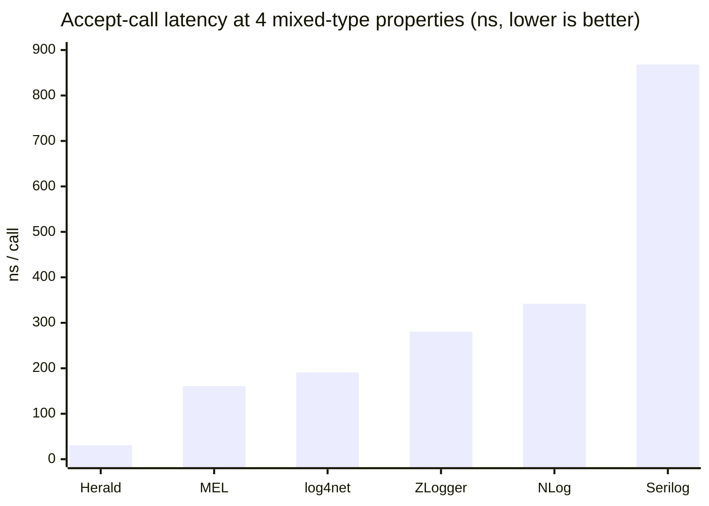
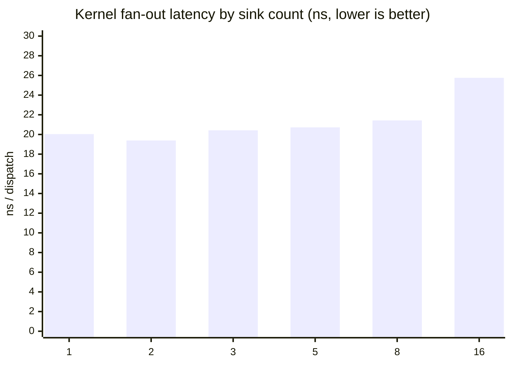
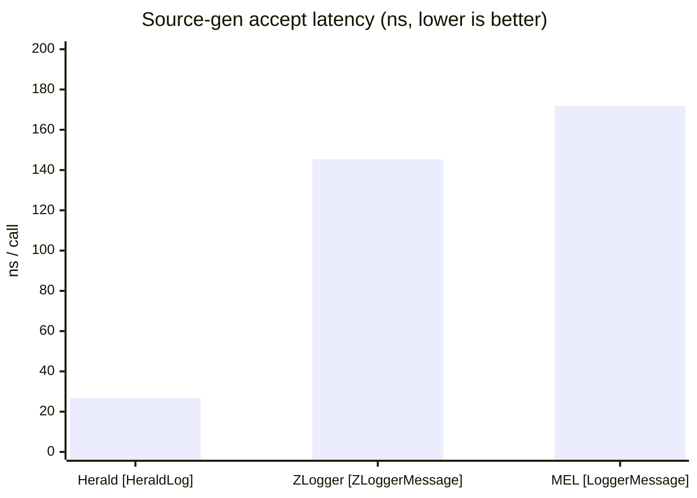
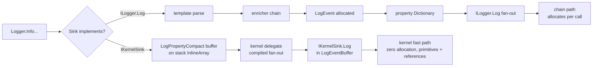

# Herald.OSS Benchmark Rollup

Current measurements for Herald.OSS on net10. Every row is sourced
from a per-bench doc and a BenchmarkDotNet raw artifact in this
repo. Reproduce instructions at the bottom.

Last refresh: 2026-05-28. The cross-library accept sweep (§1), the
reject sweep (§1b), the Herald typed-args band (§2), and the
source-gen head-to-head (§7) were re-run on net10 on 2026-05-28; the
250 kHz sustained soak (§15) was re-measured on net10 the same day.
Those rows now cite the 2026-05-28 net10 docs in the sibling Herald
umbrella repo (`docs/2026-05-28/`). Sections §3-§6 and §8-§14 still
cite the 2026-05-14 net10 runs — they were not part of the 2026-05-28
batch, and they remain net10 measurements.

## Host

```
BenchmarkDotNet v0.14.0, Windows 11 (10.0.26200.8457)
12th Gen Intel Core i9-12900K, 1 CPU, 24 logical and 16 physical cores
.NET SDK 10.0.204
  [Host]     : .NET 10.0.8 (10.0.826.23019), X64 RyuJIT AVX2
```

The 2026-05-28 cross-library suite (§1, §1b) ran DefaultJob
(separate-process). The Herald-only suite (§2, §7, accept/reject
headline) ran InProcess (`InProcessEmitToolchain`). The 2026-05-14
runs that source §3-§6 and §8-§14 ran InProcess. Every run is on the
same host and the same .NET 10.0.8 runtime.

## Summary

> **NOTE — 2026-05-28 net10 promotion.** The cross-library accept sweep
> (§1) and a new cross-library reject sweep (§1b) were re-run on net10
> on 2026-05-28 across the full 0/1/2/4/8/16 arity axis. Herald is the
> only library that holds 0 B at every arity; competitors box value-type
> args, so their bytes climb with property count. The Herald accept
> headline lands at ~26 ns / 0 B (structured-through-pipeline plain
> 25.49 ns); source-gen accept 25.67 ns / 0 B; the IsEnabled reject gate
> 0.34 ns / 0 B. The 250 kHz sustained soak (§15) is now a net10 figure.

| Workload | Herald | Note |
|---|---|---|
| Accept call, 4 mixed-type props | 30.73 ns, 0 B (genuine) | MEL 160.80 ns, 208 B is the closest competitor by latency; NLog 341.87 ns, 248 B; Serilog 868.07 ns, 720 B — see §1 |
| Accept call, 16 mixed-type props | 39.50 ns, 0 B | log4net 248.5 ns, 648 B is the closest; ZLogger 412.8 ns, 209 B; MEL 518.04 ns, 648 B — see §1 |
| Accept headline (structured pipeline, plain) | 25.49 ns, 0 B | InProcess Herald-only run; PipelineBenchmarks plain row 25.56 ns — see §2 |
| Source-gen accept, 4 props | 25.67 ns, 0 B | Manual 4-param equivalent 36.71 ns, 208 B on the same bench — see §7 |
| Source-gen vs competitors | 26.73 ns, 0 B | ZLogger 145 ns, 7 B; MEL 172 ns, 232 B (competitor rows 2026-05-14) — see §7 |
| Rejected call (below floor) | 0.20 – 4.29 ns | IsEnabled gate 0.34 ns; sub-nanosecond until 16 typed args force argument evaluation — see §1b |
| Sustained accept rate | 250 kHz / 5 min / 75M events | 0 alloc drift, 0 GC, flat 0.34 ms max pause — see §15 |
| Endurance soak, 100 kHz × 24h | 8.4B events, 0 drop / 0 error | dead-on pacing, no drift over 24h; 100/250 kHz × 24-conn throughput = 2.4M/6.0M evt/s; 250 kHz × 12h pending — see §17 |
| Redaction overhead (fast path) | +8 ns vs baseline, 0 B | No peer ships an equivalent fast path |
| Hot-reload JSON config swap | 40 μs end-to-end | No peer ships JSON-driven runtime swap |
| Kernel fan-out, 16 sinks | 26 ns | Flat scaling 1 → 16 sinks |
| Flight recorder, below-floor capture | ~0 ns | JIT-eliminated |
| Sink isolation, 1 throwing sink of 5 | 2.4 μs/event | Pipeline survives; cost is .NET exception overhead |
| MEL adapter (Herald via `ILogger<T>`) | 149 ns, 168 B | MEL native is 152 ns, 208 B |
| UTF-8 format end-to-end | 403 ns, 224 B | ZLogger 277 ns, 67 B is fastest |
| One non-IKernelSink sink mixed in | 691 ns, 1,160 B | 25× pure-kernel cost; sink disqualifies kernel, pipeline runs chain path |
| Destructure-policy vs Serilog (null sink) | 27 ns, 0 B | Serilog eager: 533 ns, 1,320 B |
| Serilog drop-in, `{@Position}` arity-2 (cloud) | 39.7 ns, 0 B | Real Serilog 323 ns, 672 B — 8.1× faster, 0-alloc; recompiled Serilog code 50 ns, 0 B — see §16 |
| Serilog drop-in, rejected call (cloud) | 0 B every arity | Real Serilog allocates 32→512 B on filtered-out calls — see §16 |
| Hot-reload cutover with interleaved emits | 36 μs / iteration | Zero event loss across 3.28M iterations |

---

## 1. Accept-call comparison (cross-library, 0 → 16 mixed-type props)

Workload: `logger.Info(template, args...)` with mixed-type args
(string/int/bool/double) so every library is measured on the same
realistic shape. Each library configured with its idiomatic null /
discarding sink (Herald `WithNullSink()`, MEL `NullLogger`, NLog
`NullTarget`, log4net `NullAppender`, Serilog discarding sink, ZLogger
no-op sink). Same `AcceptCallBenchmarks` class per library.

> Re-run on net10 on 2026-05-28 across the full 0/1/2/4/8/16 arity
> axis (DefaultJob, separate-process). Competitor package versions:
> MEL 10.0.8, Serilog 4.3.1, NLog 5.5.1, ZLogger 2.5.10, log4net 3.0.3.
> Herald specializes primitives without a box and holds 0 B across the
> whole sweep; competitors box value-type args, which is why their
> bytes climb with property count.

### Latency at 4 props



### Allocation at 4 props


Herald is the only library that holds 0 B at every arity. The
competitors box value-type args, so their bytes climb with property
count.

### Full arity sweep (mean ns / allocated bytes)

| props | Herald | Serilog | NLog | ZLogger | MEL | log4net |
|------:|-------:|--------:|-----:|--------:|----:|--------:|
| 0  | 24.68 / 0 B | 88.53 / 160 B | 125.41 / 120 B | 283.8 / 0 B | 11.06 / 0 B | 162.3 / 168 B |
| 1  | 26.38 / 0 B | 134.60 / 384 B | 39.28 / 176 B | 266.1 / 0 B | 51.61 / 104 B | 180.8 / 264 B |
| 2  | 27.07 / 0 B | 510.03 / 424 B | 178.58 / 184 B | 272.0 / 0 B | 67.71 / 128 B | 180.9 / 272 B |
| 4  | 30.73 / 0 B | 868.07 / 720 B | 341.87 / 248 B | 280.6 / 66 B | 160.80 / 208 B | 190.8 / 336 B |
| 8  | 38.40 / 0 B | 1257.41 / 1096 B | 1707.34 / 984 B | 315.1 / 117 B | 279.03 / 352 B | 211.7 / 440 B |
| 16 | 39.50 / 0 B | 2020.20 / 1792 B | 4888.75 / 2480 B | 412.8 / 209 B | 518.04 / 648 B | 248.5 / 648 B |

> **Methodology note — noisy low-arity competitor cells.** Two
> 0-property competitor cells read out of line with their own
> neighbours: NLog at 125 ns (its 1-prop row is 39 ns) and MEL at
> 11 ns. Both look like first-benchmark warmup artifacts — the 0-prop
> row is the first benchmark each library runs. The numbers render as
> measured rather than smoothed.

Source: `docs/2026-05-28/comparison-benchmarks-net10.md` (Accept
table), host .NET 10.0.8, i9-12900K, runDate 2026-05-28. The doc
lives in the sibling Herald umbrella repo.

---

## 1b. Reject-call comparison (cross-library, Debug vs Info-minimum)

Every library sees a Debug-level call against an Info-minimum logger.
The call sits below the floor and never reaches a sink. The honest
signal is the guarded-vs-unguarded split — an unguarded call evaluates
(and boxes) its args before the level gate runs; a hand-written
`IsEnabled` guard skips that work but is boilerplate the developer
adds at every below-floor call site.

| shape | Herald | Serilog | NLog | ZLogger | MEL | log4net |
|------|-------:|--------:|-----:|--------:|----:|--------:|
| Debug 0-prop (unguarded) | 0.20 / 0 B | 0.20 / 0 B | ~0 / 0 B | 1.20 / 0 B | 5.24 / 0 B | 3.15 / 0 B |
| Debug 1-prop (unguarded) | 3.41 / 0 B | ~0 / 0 B | ~0 / 0 B | 1.36 / 0 B | 17.77 / 56 B | 41.52 / 24 B |
| Debug 4-prop (unguarded) | 6.04 / 0 B | 126.32 / 128 B | 18.63 / 128 B | 1.34 / 0 B | 29.21 / 128 B | 221.96 / 128 B |
| Debug 4-prop (guarded, IsEnabled) | n/a* | 0.20 / 0 B | ~0 / 0 B | 0.62 / 0 B | 0.43 / 0 B | 2.24 / 0 B |
| Accepted Warn baseline (reference) | 24.53 | 325.37 | 33.66 | 287.02 | 9.33 | 558.79 |

\*Herald has no guarded variant because it needs no `IsEnabled`
boilerplate — the typed-args reject is cheap and 0 B on its own.
Herald's reject rises with arity (0.20 → 6.04 ns at 4 typed args)
because the args are evaluated before the level gate, like any
unguarded call — but it never allocates and needs no guard. Near-zero
(~0) cells are calls the JIT proved are no-ops and elided — below the
measurement floor.

Source: `docs/2026-05-28/comparison-benchmarks-net10.md` (Reject
table), host .NET 10.0.8, i9-12900K, runDate 2026-05-28.

---

## 2. Herald typed-args + array band (0 → 16 props)

> *Herald-only measurement (InProcess). The cross-library comparison
> lives in §1.*

Two Herald accept shapes swept across 0/4/8/16 properties:
`Info<T1..Tn>` typed-args overloads (the production shape, primitives
ride along without a box) and the array-shaped property overload. Both
stay at 0 B at every arity in this sweep; latency climbs with property
count while allocation stays flat at zero.

| props | Typed args | Array |
|------:|-----------:|------:|
| 0  | 25.56 ns / 0 B | 25.56 ns / 0 B |
| 4  | 26.34 ns / 0 B | 26.81 ns / 0 B |
| 8  | 26.80 ns / 0 B | 28.89 ns / 0 B |
| 16 | 37.23 ns / 0 B | 32.84 ns / 0 B |

The 16-typed-args point (37.23 ns) is the visible latency cliff —
still 0 B. The one allocating case in the same family: a value-type
element handed to the array-shaped overload boxes (~24 B per box; a
2-property boxed call reads 28.67 ns / 24 B). Typed-args carry
int/long/double/bool/DateTime without that box.

Source: `docs/2026-05-28/benchmarks-21-01.md` (PipelineBenchmarks),
host .NET 10.0.8, runDate 2026-05-28.

---

## 3. Rejected-call (events below the pipeline floor)

A Debug call against an Info-minimum pipeline, swept across 0/4/8/16
typed properties. The level gate rejects below-threshold calls at
sub-nanosecond cost and zero bytes, flat across arity, until the
runtime is forced to evaluate sixteen typed arguments before the gate
runs.

| Shape | Mean | Allocated |
|---|---:|---:|
| Rejected, 0 props (structured, no args) | 0.2035 ns | 0 B |
| Rejected, 4 typed args | 0.2045 ns | 0 B |
| Rejected, 8 typed args | 0.2029 ns | 0 B |
| Rejected, 16 typed args | 4.2866 ns | 0 B |
| IsEnabled-only gate (reference) | 0.3417 ns | 0 B |
| Source-gen reject, 4 params (reference) | 0.2078 ns | 0 B |

The 16-typed-args climb (4.29 ns) is argument preparation — the
runtime evaluates the sixteen arguments (and their caller-argument
expression names) before the level gate runs. Allocation never moves
off zero.

Source: `docs/2026-05-28/benchmarks-21-01.md` (PipelineBenchmarks),
host .NET 10.0.8, runDate 2026-05-28.

---

## 4. Redaction

One PII property, Mask mode. Three pipelines on identical workload.

| Pipeline | Mean | Allocated |
|---|---:|---:|
| Baseline (no redaction) | 25.96 ns | — |
| `WithFastRedaction` | 34.20 ns | — |
| `WithCompiledRedaction` | 407.42 ns | 672 B |

Source: `redaction-net10-2026-05-14T19-09Z.md`.

---

## 5. Hot reload (JSON config swap)

End-to-end `HotReloadBootstrap.Reload(json)` including JSON parse.

| Path | Mean | Allocated |
|---|---:|---:|
| Fast path (level-only delta) | 40.15 μs | 53.79 KB |
| Slow path (structural rebuild) | 32.65 μs | 53.79 KB |

Source: `hot-reload-net10-2026-05-14T19-09Z.md`.

---

## 6. Kernel fan-out (1 → 16 sinks)



Source: `kernel-fan-out-net10-2026-05-14T19-09Z.md`.

---

## 7. Source-gen head-to-head

`[HeraldLog]` vs `[ZLoggerMessage]` vs `[LoggerMessage]` on the
same template plus four typed arguments.



| Library | Mean | Allocated |
|---|---:|---:|
| Herald `[HeraldLog]` | 26.73 ns | — |
| ZLogger `[ZLoggerMessage]` | 145.32 ns | 7 B |
| MEL `[LoggerMessage]` | 171.89 ns | 232 B |

Herald row source: `source-gen-net10-2026-05-14T23-10Z.md`. Competitor
rows (ZLogger / MEL) preserved from the same 2026-05-14 net10 run.

### Generated vs manual (2026-05-28 net10)

The `[HeraldLog]`-generated path against the hand-written equivalent
on the same bench. The generated path keeps the consumer in the
zero-allocation band; the manual call shape boxes its args.

| Method | Mean | Allocated |
|---|---:|---:|
| Generated: info, no params | 24.91 ns | 0 B |
| Manual: info, no params | 26.95 ns | 24 B |
| Generated: info, 4 params | 25.67 ns | 0 B |
| Manual: info, 4 params | 36.71 ns | 208 B |
| Generated: rejected (debug < warn), 4 params | 0.2078 ns | 0 B |
| Manual: rejected (info < warn), 4 params | 13.55 ns | 208 B |

Source: `docs/2026-05-28/benchmarks-21-01.md`
(GeneratedVsManualBenchmarks), host .NET 10.0.8, runDate 2026-05-28.

---

## 8. MEL adapter overhead

Logging through Herald via `ILogger<T>`, compared to native Herald
and bare MEL.

| Path | Mean | Allocated |
|---|---:|---:|
| Herald native | 27.53 ns | — |
| Herald via MEL adapter | 149.15 ns | 168 B |
| MEL native (active null) | 152.41 ns | 208 B |

Source: `mel-adapter-net10-2026-05-14T23-10Z.md`.

---

## 9. UTF-8 format end-to-end

Emit to UTF-8 bytes through each library's idiomatic
format-to-discard sink.

| Library | Mean | Allocated |
|---|---:|---:|
| Herald `Utf8JsonFormatter` | 402.9 ns | 224 B |
| ZLogger UTF-8 | 277.4 ns | 67 B |
| Serilog `CompactJsonFormatter` | 445.9 ns | 968 B |

Source: `utf8-format-net10-2026-05-14T23-10Z.md`.

---

## 10. Sink isolation

Five bridge sinks; one throws `InvalidOperationException` on every
emit. `SafeCompositeLogger` catches and continues.

| Configuration | Mean | Allocated |
|---|---:|---:|
| Five healthy bridge sinks | 397.3 ns | 664 B |
| Four healthy + one throwing | 2,406.1 ns | 1,224 B |

Source: `sink-isolation-net10-2026-05-14T23-10Z.md`.

---

## 11. One non-IKernelSink sink mixed in (kernel eligibility tax)

What does adding a single sink that skips `IKernelSink` cost? Every
built-in Herald.OSS sink implements the interface; a custom sink
that doesn't disqualifies the kernel for the whole pipeline, and
every emit takes the chain path instead of the kernel fast path.

| Pipeline | Mean | Allocated |
|---|---:|---:|
| Pure kernel (all sinks are `IKernelSink`) | 27.67 ns | — |
| One non-IKernelSink sink mixed in | 691.05 ns | 1,160 B |

The 25× delta is the chain-path cost the whole pipeline pays — heap
`LogEvent` construction, property list materialization, context
dictionary copy, rendered message. Adopters who want the best
numbers implement `IKernelSink` on every custom sink. The
diagnostic `QuickLogResult.KernelDiagnostic.RejectionReason` names
the specific sink that failed eligibility so it's straightforward
to find.

Source: `kernel-mixed-sink-net10-2026-05-14T23-10Z.md`.

---

## 12. Destructure-policy shootout vs Serilog

Both libraries support a "transform this type when captured under
`{@Name}`" projection. Same 5-property POCO, same projection,
discarding sinks on both sides.

| Library | Mean | Allocated |
|---|---:|---:|
| Herald (lazy: skip when null sink) | 27.04 ns | — |
| Serilog (eager: runs at LogEvent construction) | 533.14 ns | 1,320 B |

Honest framing: this isn't a head-to-head on destructuring speed
itself. Herald defers the projection until a sink asks for the
rendered form; with a null sink the projection never fires. Serilog
runs the projection at event construction; even discarding sinks
pay the cost. Both are legitimate designs — for null/discarding/
async sinks Herald saves the work entirely.

Source: `destructure-net10-2026-05-14T23-10Z.md`.

---

## 13. Hot-reload cutover with in-flight events

Reload alone vs reload interleaved with emits. A counting kernel
sink verifies no events are lost across the swap.

| Path | Mean | Allocated |
|---|---:|---:|
| Reload_Alone | 32.13 μs | 53.83 KB |
| Reload_With_Interleaved_Emits (4 + reload + 4) | 36.23 μs | 59.20 KB |

Counter sink received exactly the expected total (3.28M events
across the bench window). The atomic swap inside `SwappableLogger`
guarantees no in-flight emit is dropped or duplicated.

Source: `hot-reload-cutover-net10-2026-05-14T23-10Z.md`.

---

## 14. Flight recorder

Below-floor capture into a 200-event ring buffer; trigger drains
the buffer on `error`.

| Path | Mean | Allocated |
|---|---:|---:|
| Below-floor capture (recorder on) | 0.20 ns | — |
| Below-floor reject (recorder off) | 0.22 ns | — |
| Trigger emit (drain current buffer) | 30.41 ns | 24 B |

Source: `flight-recorder-net10-2026-05-14T23-10Z.md`.

---

## 15. Sustained-rate soak (250 kHz, 5 min)

A re-run of the published 250 kHz sustained figure on net10. Workload
is typed16 (16-property typed-args) through `WithNullSink` so the
kernel + pipeline are isolated. GC server/interactive.

| t | cumulative | rate | working set | alloc/min | gen0/1/2 | max pause |
|---|---:|---:|---:|---:|---:|---:|
| t+60s  | 15,010,000 | 250,083/s | 44 MB | 0 MB | 0/0/0 | 0.34 ms |
| t+120s | 30,010,000 | 249,981/s | 44 MB | 0 MB | 0/0/0 | 0.34 ms |
| t+180s | 45,010,000 | 250,019/s | 44 MB | 0 MB | 0/0/0 | 0.34 ms |
| t+240s | 60,010,000 | 249,984/s | 44 MB | 0 MB | 0/0/0 | 0.34 ms |
| final  | 75,000,000 in 300s | ~250 kHz | flat 44 MB | 0 drift | 0 GC | 0.34 ms |

Herald sustains 250 kHz for 5 minutes / 75M events with zero
allocation drift, zero GC collections of any generation, and a flat
0.34 ms max pause. This is a soak figure, not an in-process
micro-benchmark.

Source: `docs/2026-05-28/soak-net10.md`, host .NET 10.0.8, i9-12900K,
runDate 2026-05-28.

---

## 16. Serilog drop-in: `{@Position}` destructure family (cloud baseline)

The canonical destructure example from https://serilog.net/
(`log.Information("Processed {@Position} in {Elapsed:000} ms.", position, elapsedMs)`)
swept across arity 1/2/4/8/12/16, three ways: Herald native, the Serilog-compat
adapter (existing `using Serilog;` code recompiled), and real Serilog 4.3.1.

> **Host (differs from the rest of this rollup):** isolated Azure VM,
> `Standard_F8als_v6` (AMD EPYC 9V74, 8 physical cores, no hyperthreading),
> Ubuntu, .NET 10, BenchmarkDotNet, commit `c898771`. Chosen as canonical for
> its tight variance; a higher-clock `Standard_FX12mds_v2` cross-check shows the
> same shape ~25% faster. Allocations are hardware-independent and identical to
> the desktop rows above. Full detail + the Xeon cross-check:
> `docs/2026-05-31/benchmarks-1732.md`.

**Accept (event passes the gate):**

| Arity | Herald native | Herald compat (drop-in) | Real Serilog 4.3.1 |
|---|---|---|---|
| 1  | 36.45 ns, 0 B | 39.87 ns, 0 B | 287.3 ns, 640 B |
| 2  | 39.73 ns, 0 B | 50.46 ns, 0 B | 323.2 ns, 672 B |
| 4  | 44.71 ns, 0 B | 76.36 ns, 0 B | 413.3 ns, 968 B |
| 8  | 61.39 ns, 0 B | 123.8 ns, 0 B | 519.4 ns, 1368 B |
| 12 | 62.93 ns, 0 B | 164.5 ns, 0 B | 661.6 ns, 1824 B |
| 16 | 57.85 ns, 0 B | 208.5 ns, 0 B | 796.3 ns, 2112 B |

Herald native holds **0 B at every arity** and runs 8–14× faster than Serilog,
whose allocation climbs 640 → 2112 B with property count. The drop-in adapter
keeps 0 B with no source change.

**Reject (event below the floor) — allocation is the clean signal:**

| Arity | Herald native | Herald compat | Real Serilog 4.3.1 |
|---|---|---|---|
| 1  | 0 B | 0 B | 32 B  |
| 4  | 0 B | 0 B | 128 B |
| 8  | 0 B | 0 B | 256 B |
| 12 | 0 B | 0 B | 384 B |
| 16 | 0 B | 0 B | 512 B |

Serilog's `params object?[]` overload builds the array and boxes the ints at the
call site before its level gate runs, so a filtered-out call still allocates.
Herald rejects at 0 B. (Arity-2 omitted: the JIT elided that specific call in the
harness — see the dated doc.)

---

## 17. Endurance soaks (multi-hour)

§15 is a 5-minute sustained window. These are the long-duration endurance runs
on isolated Azure VMs, .NET 10, that prove the pipeline holds rate overnight
without drift or leak.

### 100 kHz × 24h — single connection (complete)

| Metric | Value |
|---|---|
| Rate (achieved / target) | 100,000.1 / 100,000 events/sec |
| Duration | ~24h (280 × 300s windows) |
| Total events delivered | **8,400,010,000** |
| Dropped | **0** |
| Drain errors | **0** |
| Max pause (sample — see caveat) | 0.64 ms |
| Host | `Standard_D8ds_v6`, Server GC, .NET 10.0.8, single connection, typed4 workload, null sink |

8.4 billion events at a dead-on 100 kHz across a full day, zero dropped, zero
drain errors. No drift across 280 windows.

> **Pause caveat (carry it verbatim):** 0.64 ms is the largest pause in a *sparse
> sample* — the runtime's `GCMemoryInfo.PauseDurations` ring buffer overwrites in
> place, so pauses are lost when GC fires faster than the poll. It is a **lower
> bound, not the population max**. Do not publish "max pause is bounded at 0.64 ms."

### Multi-connection throughput (companion, 5-min)

From Jared's 0.10.2 per-connection-drain report (same net10 topology): 100 kHz × 24
connections sustained **2.4M events/sec aggregate** (720M events / 5 min), and 250
kHz × 24 connections sustained **6.0M events/sec aggregate** (1.8B events / 5 min) —
both with zero drops and zero drain errors. This is the *throughput* axis (many
independent drains), distinct from the *endurance* axis above (one stream, 24h).

### 250 kHz × 12h — pending

The 12-hour 250 kHz endurance run is in progress on `herald-soak-250k-12h-vm`. Its
numbers land here when the run completes.

Sources: `Herald/docs/_wip/soak-test-2026-05-28/results-24h/soak-24h-summary.json`
(24h run) and `soak-100khz-250khz-0.10.2-report.md` (multi-connection 5-min).

---

## Architecture

Two paths through the pipeline. Adopters pick which one their sink
takes by which interface they implement.



Standalone diagram: `hot-path-comparison.excalidraw`.

---

## Reproduce

```bash
git clone git@github.com:mmpworks/Herald.OSS.git
cd Herald.OSS

dotnet build benchmarking/library/net10/Herald.OSS.LibraryBenchmarks.csproj -c Release
dotnet build benchmarking/comparisons/net10/herald/Herald.Comparison.csproj -c Release

dotnet benchmarking/comparisons/net10/herald/bin/Release/net10.0/Herald.Comparison.dll \
  --filter "*" \
  --artifacts benchmarking/comparisons/net10/herald/results

dotnet benchmarking/library/net10/bin/Release/net10.0/Herald.OSS.LibraryBenchmarks.net10.dll \
  --filter "*" \
  --artifacts benchmarking/library/net10/results
```

For competitor rows: replace `herald` with `serilog`, `nlog`,
`zlogger`, `log4net`, or `MEL`.

Full methodology: `HOWTO.md`.

---

## Source docs

2026-05-28 net10 docs (sibling Herald umbrella repo, sourcing §1, §1b,
§2, §3, §7 generated-vs-manual, §15):

- `docs/2026-05-28/comparison-benchmarks-net10.md` (cross-library accept + reject)
- `docs/2026-05-28/benchmarks-21-01.md` (Herald-only accept/reject/arity + generated-vs-manual)
- `docs/2026-05-28/soak-net10.md` (250 kHz sustained soak)

The 2026-05-28 0.10.2 internal rebench (allocation-regression gate;
allocations byte-identical to baseline on every Herald path) is at
`runs/run-2026-05-28T04-02Z-0.10.2-rebench/rebench-delta-0.10.2.md`.

2026-05-14 net10 docs (sourcing §4-§6, §8-§14, and the §7 competitor rows):

- `comparison-accept-call-net10-2026-05-14T18-10Z.md`
- `typed-args-net10-2026-05-14T19-30Z.md`
- `rejected-call-net10-2026-05-14T19-09Z.md`
- `redaction-net10-2026-05-14T19-09Z.md`
- `hot-reload-net10-2026-05-14T19-09Z.md`
- `kernel-fan-out-net10-2026-05-14T19-09Z.md`
- `accept-path-net10-2026-05-14T18-10Z.md`
- `source-gen-net10-2026-05-14T23-10Z.md`
- `mel-adapter-net10-2026-05-14T23-10Z.md`
- `utf8-format-net10-2026-05-14T23-10Z.md`
- `sink-isolation-net10-2026-05-14T23-10Z.md`
- `flight-recorder-net10-2026-05-14T23-10Z.md`
- `kernel-mixed-sink-net10-2026-05-14T23-10Z.md`
- `destructure-net10-2026-05-14T23-10Z.md`
- `hot-reload-cutover-net10-2026-05-14T23-10Z.md`
