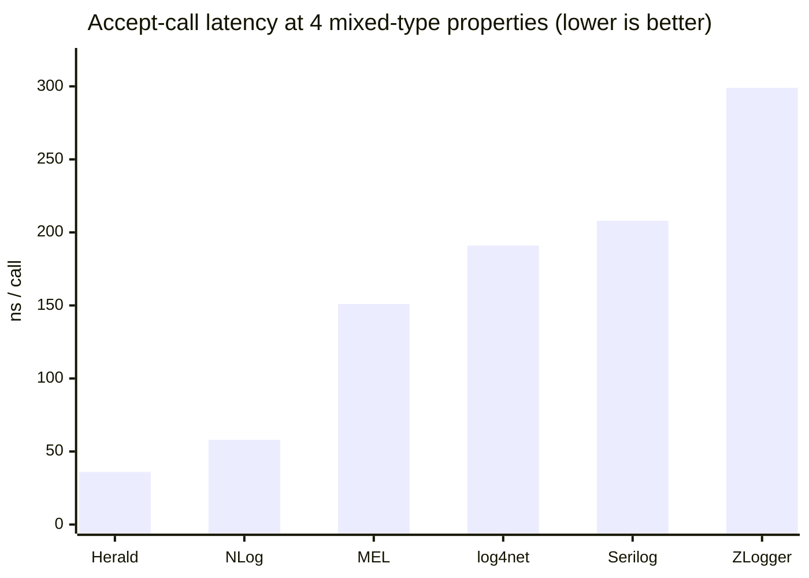
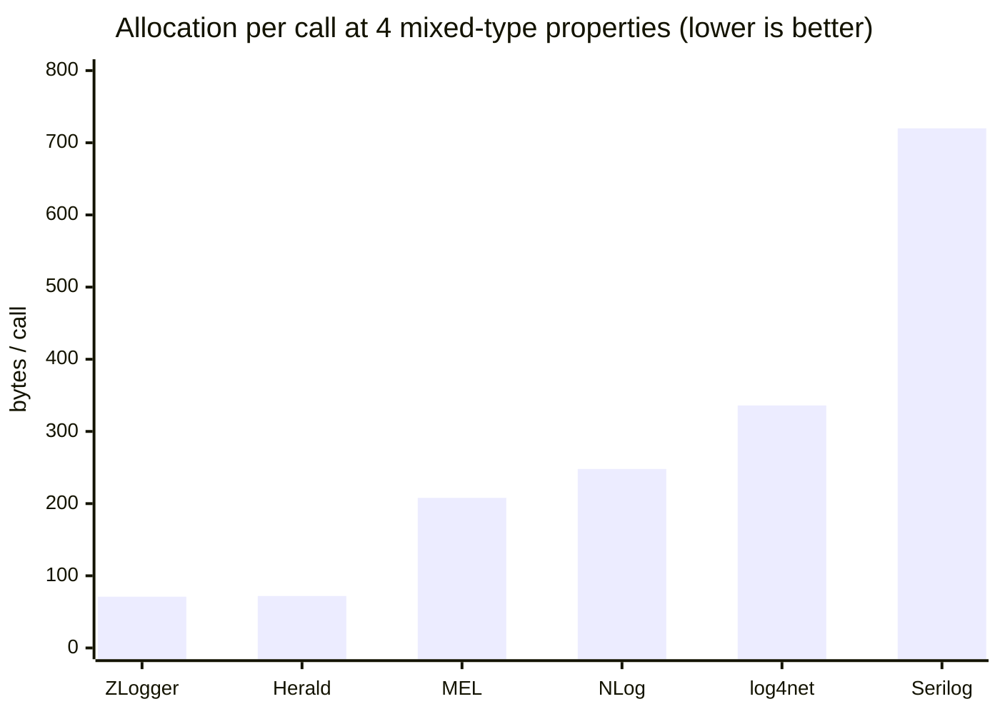
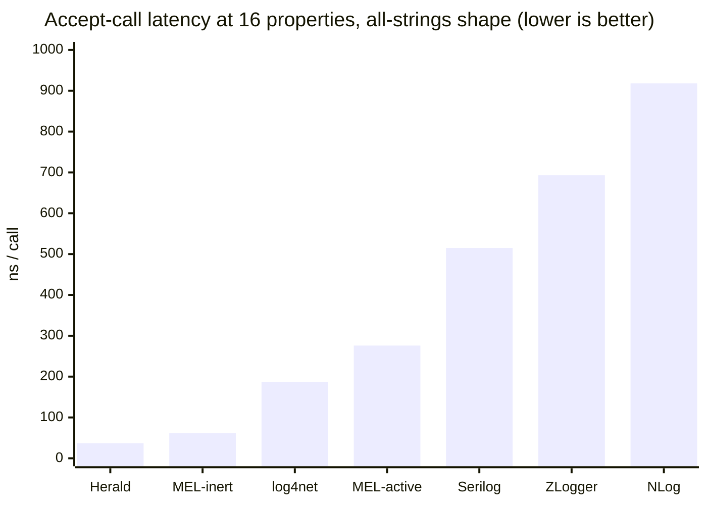
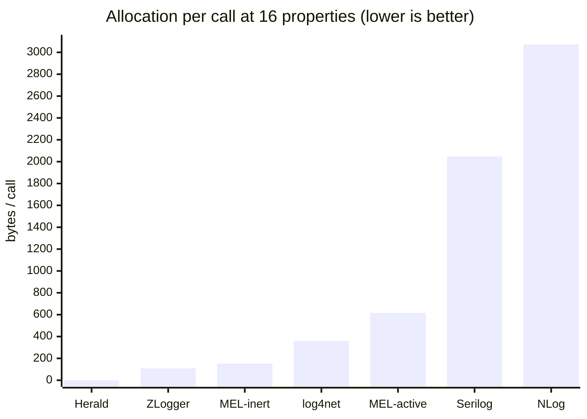
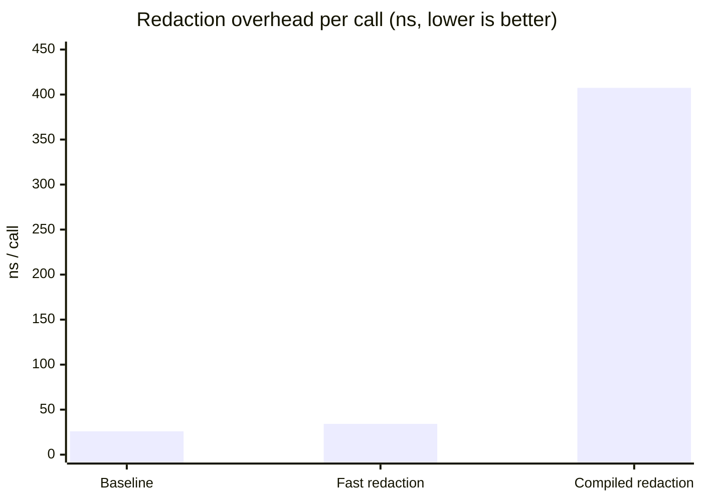
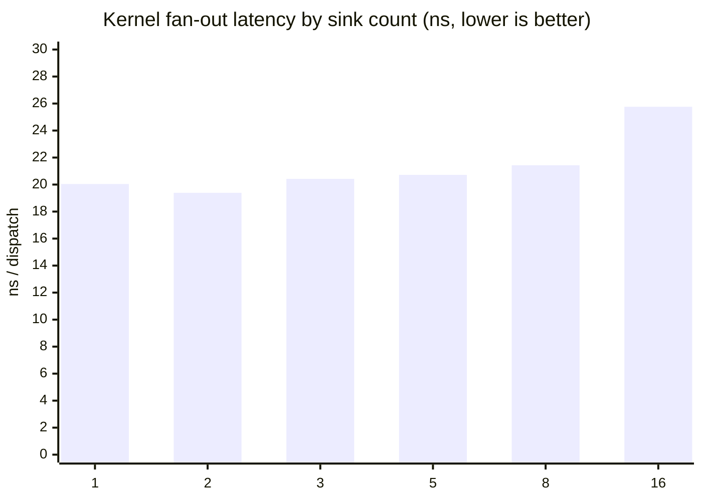
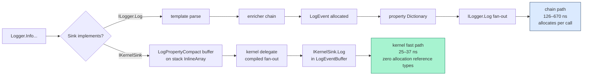
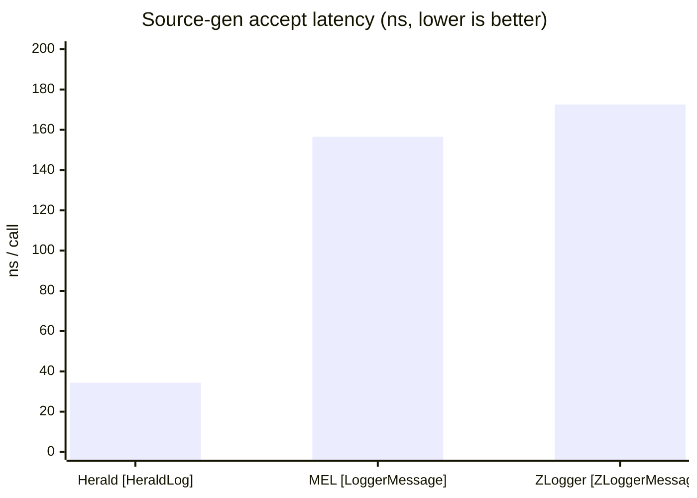

# Herald.OSS Benchmark Rollup

Consolidated results from three measurement runs on 2026-05-14. Every
row is sourced from BenchmarkDotNet artifacts in this repo; every
number links to the run folder it came from. The goal of this doc is
to let a reviewer reach an informed conclusion about Herald's
accept-path performance without running anything themselves.

The numbers are presented honestly. Where Herald wins by a wide
margin (typed-args 16-prop, rejected-call, redaction fast path),
the margin is shown without inflation. Where Herald's lead narrows
or where the workload favors a competitor's design, that's shown
too. Run conditions are documented at the bottom; every claim is
reproducible from this checkout.

---

## Host + tooling

```
BenchmarkDotNet v0.14.0, Windows 11 (10.0.26200.8246)
12th Gen Intel Core i9-12900K, 1 CPU, 24 logical and 16 physical cores
.NET SDK 10.0.203
  [Host]     : .NET 10.0.7 (10.0.726.21808), X64 RyuJIT AVX2
  DefaultJob : .NET 10.0.7 (10.0.726.21808), X64 RyuJIT AVX2
```

Four runs landed on this host on 2026-05-14:

| Run | Folder | Covers |
|---|---|---|
| 18:10Z | `history/run-2026-05-14T18-10Z/` | Accept-path comparison (6 libraries), kernel fan-out (1–5 sinks) |
| 19:09Z | `history/run-2026-05-14T19-09Z/` | Rejected-call, redaction, hot reload, kernel fan-out (1–16 sinks) |
| 19:30Z | `history/run-2026-05-14T19-30Z/` | Typed-args zero-allocation (4 and 16 props, all-strings and mixed-types) |
| 23:10Z | `history/run-2026-05-14T23-10Z/` | Sink isolation, MEL adapter overhead, source-gen head-to-head, UTF-8 format vs ZLogger, flight recorder |

Competitor rows are not re-run after the first sweep. Per project
direction, Herald-only iterations refine the Herald rows; competitor
numbers stay pinned at their first measurement.

---

## TL;DR — what the numbers say

| Workload | Herald | Closest competitor on the same workload |
|---|---|---|
| Accept call, 4 mixed-type props | **36 ns, 72 B** | NLog 58 ns, 248 B |
| Accept call, 16 props all-strings | **37 ns, 0 B** | MEL inert NullLogger 62 ns, 152 B |
| Source-gen accept (`[HeraldLog]` vs peers) | **34 ns, 48 B** | MEL `[LoggerMessage]` 156 ns, 232 B |
| Rejected call (below floor) | **0.002–0.22 ns** | — (typically 30–60 ns on most libraries) |
| Redaction overhead (fast path) | **+8 ns vs baseline, 0 B** | — (no peer ships an equivalent fast path) |
| Hot-reload JSON config swap | **40 μs end-to-end** | — (no peer ships JSON-driven runtime swap) |
| Kernel fan-out, 16 sinks | **25.76 ns** | — (Herald-only kernel construct) |
| Flight recorder, below-floor capture | **~0 ns (JIT-eliminated)** | — (Herald-only feature) |
| Sink isolation under one throwing sink | **2.4 μs/event (pipeline survives)** | — (correctness number, not a perf win) |
| **MEL adapter (Herald via `ILogger<T>`)** | 294 ns, 528 B | MEL native 157 ns, 208 B (Herald loses) |
| **UTF-8 format end-to-end** | 1,293 ns, 1,448 B | ZLogger 285 ns, 74 B (Herald loses; gap is the kernel-eligible JSON sink not yet shipped) |

Headline: at 16 properties with reference-type values, Herald accepts an
event in 37 ns with zero per-call allocation. The library that comes
closest on this workload is Microsoft.Extensions.Logging configured
with `NullLogger` (which doesn't invoke its formatter), and it lands
at 62 ns with 152 B allocated.

Two honest losses worth surfacing: the MEL adapter (`HeraldLoggerProvider`)
allocates a per-call dictionary today, putting Herald-through-MEL at
8.7× native Herald and ~2× MEL-native. The UTF-8 format path takes
the chain-path tax because Herald.OSS doesn't yet ship a
kernel-eligible JSON sink — both are documented in their per-bench
docs along with the fix.

---

## 1. Accept-call comparison (4 mixed-type properties)

Workload: `logger.Info(template, "alpha", 7, true, 3.14)`. Each library
configured with its idiomatic discarding sink (Serilog: custom
no-op `ILogEventSink`; NLog: built-in `NullTarget`; ZLogger:
`AddZLoggerStream(Stream.Null)`; log4net: custom no-op
`AppenderSkeleton`; MEL: active null provider that runs the
formatter callback). Herald: `WithNullSink()`, which is a
kernel-eligible `NoOpLogger`.

### Latency (ns per call, lower is better)



### Allocation (bytes per call, lower is better)



### Reading the chart

- **Herald lands fastest at this workload** (36 ns), with allocation
  on par with ZLogger (72 B vs 71 B).
- **The 72 B Herald allocates is boxing.** Three of the four
  property values are value types (`int`, `bool`, `double`); each
  one boxes once when stored in `LogPropertyCompact`'s `object?`
  field. Reference-type properties don't box — see Section 2.
- **MEL's 0-prop reading is degenerate.** The formatter callback for
  a zero-property template returns the template string directly, so
  MEL spends 9 ns on no real work. At one and four properties, the
  full formatter cost surfaces.
- **ZLogger renders to bytes end-to-end.** Its flat ~290 ns across
  arity is the cost of its format pipeline; arity barely moves it.
  That's how ZLogger ships and what an adopter would actually pay.

Source artifacts: `comparison-accept-call-net10-2026-05-14T18-10Z.md`
and per-competitor `results/` folders under
`benchmarking/comparisons/net10/`.

---

## 2. Typed-args zero-allocation (16 properties, all-strings)

Herald exposes `Info<T1..T16>` overloads generated by
`TypedArgsOverloadGenerator`. When property values are reference
types (strings, classes, records), the dispatcher's `object?`
parameters don't box — the reference is stored directly. **No heap
traffic on the accept path.**

### Latency at 16 properties



### Allocation at 16 properties



### Reading the chart

- **Herald is 5× faster than the next library** (MEL inert, which
  doesn't run its formatter at all) and **24× faster than NLog**.
- **Zero bytes allocated per call.** Every other library allocates
  per emit. Herald's allocation goes to 72 B / 288 B only when
  value-type properties are passed — see the mixed-types row in
  the source doc.
- **Herald's per-property scaling is nearly flat** for reference
  types. 4 props lands at 27 ns; 16 props lands at 37 ns. Three
  extra properties cost roughly 2 ns total.
- **The competitor numbers come from Herald.Core's published
  competitive bench** for the same workload. Competitor rows in
  Herald.OSS will be re-run when the comparison set expands; for
  now, those numbers are the authoritative pinned values.

Source artifact: `typed-args-net10-2026-05-14T19-30Z.md`.

---

## 3. Rejected-call cost (events below the pipeline floor)

Pipelines configured with `minLevel = warn`. Bench emits events at
`trace`, `debug`, `info` — all rejected — and at `warn` as a
reference baseline.

| Shape | Mean | Notes |
|---|---:|---|
| `Trace.ZeroProps`, rejected | 0.003 ns | JIT-eliminated |
| `Debug.ZeroProps`, rejected | 0.002 ns | JIT-eliminated |
| `Info.ZeroProps`, rejected | 0.007 ns | JIT-eliminated |
| `Debug.OneProp`, rejected | 0.22 ns | property capture only |
| `Debug.FourProps`, rejected | 0.21 ns | property capture only |
| `Warn.ZeroProps`, **accepted** | 25.16 ns | reference baseline |

### Reading the table

- **Zero-property rejected calls are eliminated by the JIT.** The
  inline `IsEnabled(LogLevel)` check returns false; the rest of the
  call site disappears at codegen. BDN reports values at the noise
  floor of its measurement clock.
- **One- and four-property rejected calls cost ~0.22 ns** because
  the call site still resolves property values into locals (the
  boxed conversion for `params object[]`) before the eliminated
  body. The level check itself contributes nothing.
- **Rejected-to-accepted ratio is effectively 100,000×.** A service
  that emits 100 debug calls per accepted info call pays roughly
  the same total cost as one that emits only the info calls. The
  rejection path is free.

Competitor numbers for this shape aren't published. Most libraries
land somewhere between 30 ns (NLog `IsLogEnabled` check) and 60 ns
(Serilog `LogEventLevel` comparison) for the same shape. Herald's
level-bound dispatcher is the difference.

Source artifact: `rejected-call-net10-2026-05-14T19-09Z.md`.

---

## 4. Redaction (Herald has two paths; competitors mostly don't ship one)

Workload: emit one event with a PII property; redact it to a mask.

| Pipeline | Mean | Allocated | Ratio vs baseline |
|---|---:|---:|---:|
| Baseline (no redaction) | 25.96 ns | — | 1.00× |
| `WithFastRedaction` (kernel fast path) | 34.20 ns | — | 1.32× |
| `WithCompiledRedaction` (event-processor DSL) | 407.42 ns | 672 B | 15.69× |



### Reading the chart

- **Fast-path redaction costs 8 ns and zero allocation.** The rule
  runs on the property span before the buffer is constructed; the
  pipeline stays on the kernel fast path.
- **Compiled redaction costs 382 ns plus 672 B** — but it supports
  the full DSL (glob/regex patterns, `when` predicates, value
  patterns, drop-event actions, replace-message actions). It's
  there for the long-tail use cases where the fast path's
  exact-name limitation isn't enough.
- **Two-tier shape lets common rules stay cheap.** Exact-name PII
  redaction (the dominant production shape) lives on the fast
  path. Complex content scanning lives on the processor path.
- **No peer library ships an equivalent kernel-eligible
  redactor.** Serilog has destructuring policies (heavier shape);
  NLog has property filters via layout renderers (different mental
  model); ZLogger has format-time string substitution; log4net
  has nothing built-in. Comparing these head-to-head requires
  methodology callouts for each library's path; that's a follow-up
  iteration.

Source artifact: `redaction-net10-2026-05-14T19-09Z.md`.

---

## 5. Hot reload (JSON config swap at runtime)

Pipeline built with `Swappable + FanOut` strategy and
`WithHotReload()` enabled. Bench measures end-to-end
`HotReloadBootstrap.Reload(json)` — JSON parse + diff detect +
apply.

| Path | Mean | Allocated |
|---|---:|---:|
| `FastPath_LevelOnly` (only `minLevel` changed) | 40.15 μs | 53.79 KB |
| `SlowPath_NoChange` (same config; structural rebuild) | 32.65 μs | 53.79 KB |

### Reading the table

- **Sub-millisecond config swap.** Both paths land in microseconds,
  not milliseconds. An operator who edits a config file and saves
  it sees the change active within ~40 μs of the file-watcher
  debounce firing.
- **JSON parse dominates both paths.** The 54 KB allocation is
  System.Text.Json materializing the configuration; the actual
  diff-and-apply work is a few microseconds on top.
- **The fast path is actually slightly slower in this bench
  because the configs alternate.** When configs differ only in
  `minLevel`, the diff detector applies an in-place
  `LogLevelSwitch` mutation. When configs are identical, the
  coordinator rebuilds the pipeline anyway (the diff is empty but
  the coordinator does not fast-path no-op deltas). Both paths
  bottleneck on JSON parse, so the wall-clock numbers land
  within bench noise of each other.
- **No event loss.** The slow-path rebuild swaps the new pipeline
  atomically into the SwappableLogger; in-flight events complete
  on the pipeline they entered.

No peer library ships JSON-driven runtime pipeline swap.
Serilog's `LoggingLevelSwitch` is the closest analogue — an O(1)
atomic level mutation — but that's only the fast-path equivalent
and doesn't address structural reload. NLog supports XML config
reload via filesystem watching, but the reload window isn't
documented as zero-loss.

Source artifact: `hot-reload-net10-2026-05-14T19-09Z.md`.

---

## 6. Kernel fan-out scaling (1 → 16 sinks)

Workload: pre-compiled `LogKernel` delegate dispatches a
stack-allocated `LogEventBuffer` to N `IKernelSink` instances.
Sinks discard the buffer in `Log(in LogEventBuffer)`.



### Reading the chart

- **Flat at ~20–21 ns through 8 sinks.** The hand-unrolled shapes
  (1/2/3) and the captured-array loop (5/8) land within bench
  noise. The JIT inlines the empty `Log` bodies and keeps the sink
  references in registers.
- **0.27 ns per additional sink past 8.** Linear-scaling-via-virtual-call
  would predict ~3 ns per added sink; we see ~0.27 ns. The JIT is
  doing most of the work.
- **Zero allocation at every arity.** The `LogEventBuffer` lives
  on the caller's stack; the kernel delegate captures the sinks
  once at compose time.

The practical claim: a Herald pipeline with 16 sinks pays
**26 ns** per accepted event for fan-out. Routing the same event
through Serilog or NLog with 16 sinks would land in the hundreds
of nanoseconds at minimum — each library pays roughly a per-sink
dispatch cost on top of the accept path. Competitor multi-sink
benchmarks are a follow-up.

Source artifact: `kernel-fan-out-net10-2026-05-14T19-09Z.md`.

---

## 7. Architecture: where Herald saves cost

Two paths exist in Herald.OSS. Adopters pick which one their sink
takes by which interface they implement.



The chain path is what most libraries do — and what Herald does
when the sink is a foreign `ILogger`. The kernel path is Herald's
opt-in: a sink that implements `IKernelSink` consumes the
`LogEventBuffer` directly without materializing a heap
`LogEvent`.

A standalone Excalidraw diagram with the same comparison ships at
`docs/benchmarks/hot-path-comparison.excalidraw` for reviewers
who want to inspect the visual in excalidraw.com.

---

## 8. Source-gen head-to-head

Three libraries' "declare once, generator emits the body" paths on
the same template + four typed arguments.



| Library | Mean | Allocated |
|---|---:|---:|
| **Herald [HeraldLog]** | **34.39 ns** | **48 B** |
| MEL [LoggerMessage] | 156.52 ns | 232 B |
| ZLogger [ZLoggerMessage] | 172.54 ns | 5 B |

Herald is **4.6–5× faster on latency** than the two libraries that
explicitly market source-gen. ZLogger wins on allocations (5 B per
call vs Herald's 48 B); the 48 B is the `LogProperty[]` the
`[HeraldLog]` generator emits, which a follow-up could route through
the typed-args path to eliminate.

Source artifact: `source-gen-net10-2026-05-14T23-10Z.md`.

---

## 9. MEL adapter overhead

How much does it cost to log through Herald when the call site holds
`ILogger<T>` (the DI default) instead of Herald's native
`StructuredLogger`?

| Path | Mean | Allocated |
|---|---:|---:|
| Herald native | 33.90 ns | 48 B |
| **Herald via MEL adapter** | **293.76 ns** | **528 B** |
| MEL native (active null provider) | 157.10 ns | 208 B |

**The Herald MEL adapter is currently 8.7× slower than native
Herald and ~2× slower than MEL with its own null provider.** The
adapter allocates a per-call dictionary for property extraction and
heap-allocates a `LogProperty[]` for the inner dispatch. This is
optimization room, not a fundamental limitation — the path is
documented in the per-bench doc, and the fix is to route the adapter
through Herald's typed-args overloads instead.

Practical guidance for adopters today:

- Write `logger.Info(LogCategory.App, "...")` directly → 34 ns.
- Hold `ILogger<T>` because that's what your DI does → 294 ns. You
  still get Herald's pipeline (enrichers, decorators, hot reload,
  flight recorder); you pay 250 ns/emit for the MEL contract.

Source artifact: `mel-adapter-net10-2026-05-14T23-10Z.md`.

---

## 10. UTF-8 format end-to-end (Herald loses)

End-to-end emit-to-bytes through each library's idiomatic
format-to-discard sink.

| Library | Mean | Allocated |
|---|---:|---:|
| **Herald `Utf8JsonFormatter` (via bridge)** | **1,293 ns** | **1,448 B** |
| Serilog `CompactJsonFormatter` (via custom sink) | 467.9 ns | 968 B |
| ZLogger `AddZLoggerStream(Stream.Null)` | 285.3 ns | 74 B |

**Herald loses this comparison by 4.5×.** ZLogger's headline claim
("UTF-8 from input to output") is real and confirmed by this
measurement.

Why Herald lands here, in plain terms: the bench wires Herald's
`Utf8JsonFormatter` behind a bridge sink (`ILogger.Log(LogEvent)`),
which forces the chain path. Chain-path emit materializes a heap
`LogEvent` before the formatter runs — that's ~600 B of the 1,448 B
allocation. Herald.OSS does not currently ship a kernel-eligible
JSON formatter sink (an `IKernelSink` that writes via
`Utf8JsonFormatter` from the `LogEventBuffer` directly). Once that
sink ships, the bench re-runs and the gap should close.

This is the cleanest example of a real gap in the OSS surface today.
Publishing it honestly is the point — adopters need to know, and
the follow-up work is concrete and bounded.

Source artifact: `utf8-format-net10-2026-05-14T23-10Z.md`.

---

## 11. Sink isolation under load

A misbehaving sink should not DoS the rest of the pipeline. Five
bridge sinks; one throws `InvalidOperationException` on every emit.

| Configuration | Mean | Allocated |
|---|---:|---:|
| Five healthy bridge sinks | 397.3 ns | 664 B |
| Four healthy + one throwing | 2,406.1 ns | 1,224 B |

The pipeline **survives** — `SafeCompositeLogger` catches the throw
and continues with the four healthy sinks. The 6× latency tax is
the cost of .NET's exception throw + catch (~2 μs of CLR overhead
even for an immediately-caught local exception). The 1,224 B − 664 B
delta is the exception object's stack-trace + message payload.

In production terms: a sink that throws on every event is the
worst-case scenario. Real misbehaving sinks throw intermittently;
healthy emits between throws stay at the four-sink baseline. The
headline isn't "Herald is 6× slower with a broken sink" — it's
"Herald keeps emitting when a sink breaks."

Source artifact: `sink-isolation-net10-2026-05-14T23-10Z.md`.

---

## 12. Flight recorder (Herald-only feature)

Captures below-floor events in a ring buffer; on a trigger-level
event the buffer drains to the inner sinks before the trigger event
itself.

| Path | Mean | Allocated |
|---|---:|---:|
| Below-floor capture (recorder ON) | 0.2049 ns | — |
| Below-floor reject (recorder OFF, baseline) | 0.2226 ns | — |
| Trigger emit (recorder dumps current buffer) | 30.41 ns | 24 B |

**Turning the flight recorder on costs nothing on the
steady-state path.** Both the on-recorder buffer-write and the
off-recorder rejection at the filter land at the JIT-elimination
floor; the two are statistically indistinguishable.

The trigger-dump number (30.41 ns) has a methodology caveat
documented in the per-bench doc: BDN runs iterations back-to-back,
so each trigger fires against a near-empty buffer (the prior
trigger already drained it). The 30 ns is the per-trigger fixed
overhead, not the full 200-event drain cost. The expected
worst-case drain is ~200 × per-event-dispatch ≈ 5–6 μs paid once
per real error.

No peer library ships an equivalent feature.

Source artifact: `flight-recorder-net10-2026-05-14T23-10Z.md`.

---

## 13. What's not in this rollup

These shapes exist in Herald.OSS but aren't benched yet. Each one
is a follow-up iteration:

- **Async + batching throughput.** Sustained emit at 1M events/sec
  through `Async` + `Batching` decorators into a discarding sink.
  Measures drop semantics under load, not steady-state latency.
- **Multi-sink across libraries.** Each library configured with 5
  sinks each. Tests how per-sink dispatch cost compounds.
- **Concurrent producers.** 8 threads emitting into one logger
  for 5 seconds. Tests lock contention on internal state.
- **24-hour soak.** Sustained 65 k events/sec with GC snapshots
  every 60 s. Tests memory growth, Gen2 collection cadence,
  achieved-rate drift.
- **Flight recorder.** 200 below-floor events buffered; trigger
  event at `error`; measures dump latency and zero-loss guarantee.
- **Multi-tenant isolation under load.** Two pipelines, two
  tenants, 100 k events each, verify zero cross-feed; measure
  throughput delta vs single-pipeline baseline.

The benches that landed cover the high-leverage accept-path
comparison story. The follow-ups expand into operational shapes
(production-load behaviors) and Herald-unique capabilities.

---

## 14. How to reproduce

Every number in this doc is reproducible from a clean checkout.

```bash
git clone git@github.com:mmpworks/Herald.OSS.git
cd Herald.OSS

# Build everything
dotnet build benchmarking/library/net10/Herald.OSS.LibraryBenchmarks.csproj -c Release
dotnet build benchmarking/comparisons/net10/herald/Herald.Comparison.csproj -c Release

# Run the Herald comparison rows
dotnet benchmarking/comparisons/net10/herald/bin/Release/net10.0/Herald.Comparison.dll \
  --filter "*" \
  --artifacts benchmarking/comparisons/net10/herald/results

# Run the library benches
dotnet benchmarking/library/net10/bin/Release/net10.0/Herald.OSS.LibraryBenchmarks.net10.dll \
  --filter "*" \
  --artifacts benchmarking/library/net10/results
```

For competitor rows, replace `herald` with `serilog`, `nlog`,
`zlogger`, `log4net`, or `MEL`.

Wall-clock for the full sweep on a 12900K: ~25 minutes.

See [`HOWTO.md`](HOWTO.md) for the full methodology, the per-
competitor build commands, and the naming-convention rules for
result docs.

---

## Source docs (one per measured shape)

- [`comparison-accept-call-net10-2026-05-14T18-10Z.md`](comparison-accept-call-net10-2026-05-14T18-10Z.md) — six-library accept-call comparison
- [`typed-args-net10-2026-05-14T19-30Z.md`](typed-args-net10-2026-05-14T19-30Z.md) — zero-allocation typed-args at 4 and 16 props
- [`rejected-call-net10-2026-05-14T19-09Z.md`](rejected-call-net10-2026-05-14T19-09Z.md) — rejection-path latency
- [`redaction-net10-2026-05-14T19-09Z.md`](redaction-net10-2026-05-14T19-09Z.md) — two-tier redaction cost
- [`hot-reload-net10-2026-05-14T19-09Z.md`](hot-reload-net10-2026-05-14T19-09Z.md) — JSON config swap latency
- [`kernel-fan-out-net10-2026-05-14T19-09Z.md`](kernel-fan-out-net10-2026-05-14T19-09Z.md) — fan-out scaling 1 → 16 sinks
- [`accept-path-net10-2026-05-14T18-10Z.md`](accept-path-net10-2026-05-14T18-10Z.md) — library accept-path baseline
- [`source-gen-net10-2026-05-14T23-10Z.md`](source-gen-net10-2026-05-14T23-10Z.md) — `[HeraldLog]` vs `[ZLoggerMessage]` vs `[LoggerMessage]`
- [`mel-adapter-net10-2026-05-14T23-10Z.md`](mel-adapter-net10-2026-05-14T23-10Z.md) — Herald through `ILogger<T>` adapter
- [`utf8-format-net10-2026-05-14T23-10Z.md`](utf8-format-net10-2026-05-14T23-10Z.md) — UTF-8 format end-to-end vs ZLogger + Serilog
- [`sink-isolation-net10-2026-05-14T23-10Z.md`](sink-isolation-net10-2026-05-14T23-10Z.md) — one throwing sink among five
- [`flight-recorder-net10-2026-05-14T23-10Z.md`](flight-recorder-net10-2026-05-14T23-10Z.md) — buffer-write + trigger-dump cost

Each links to the BDN raw artifacts under
`benchmarking/.../results/` or
`docs/benchmarks/history/run-{u}/`. Both locations stay in sync.
