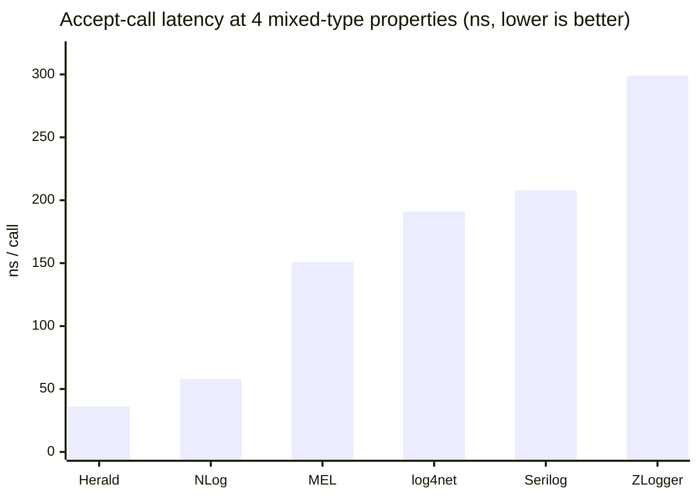
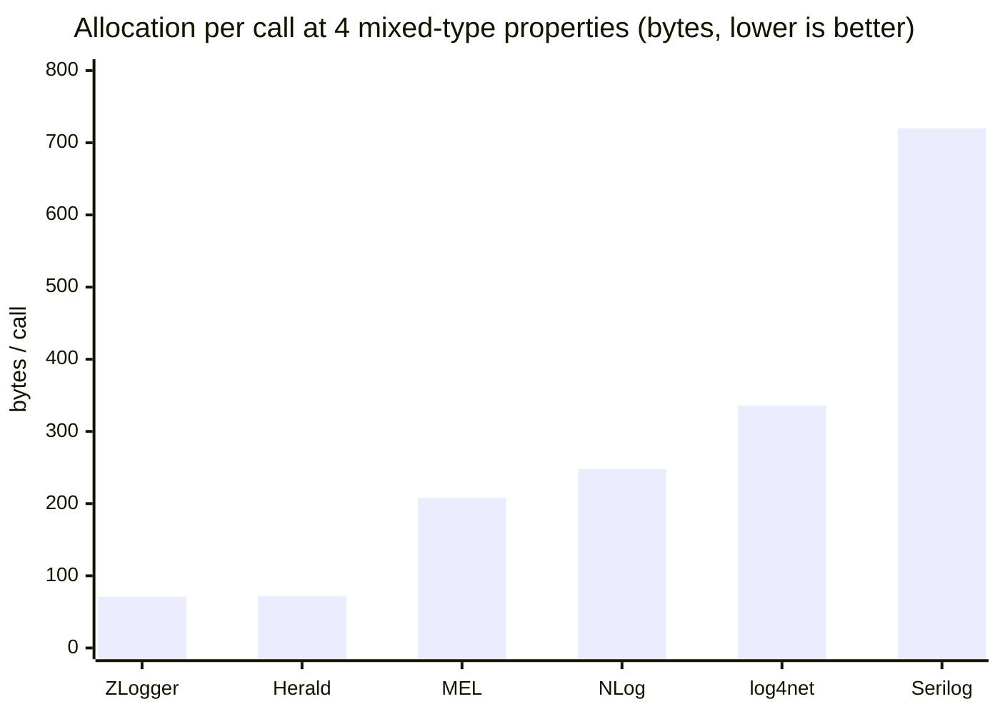
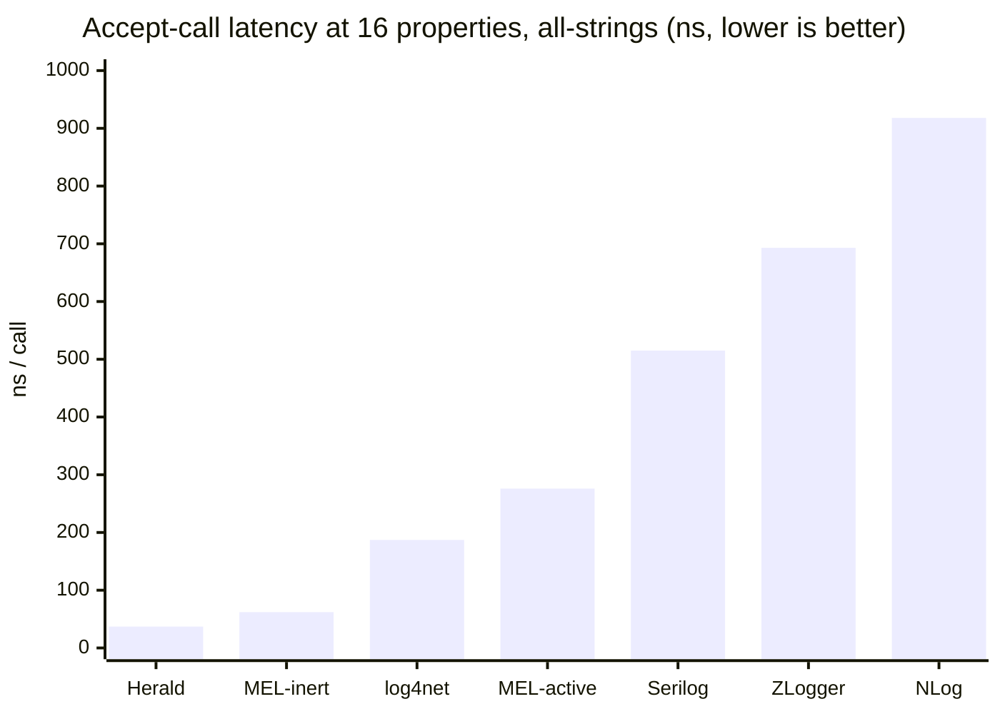
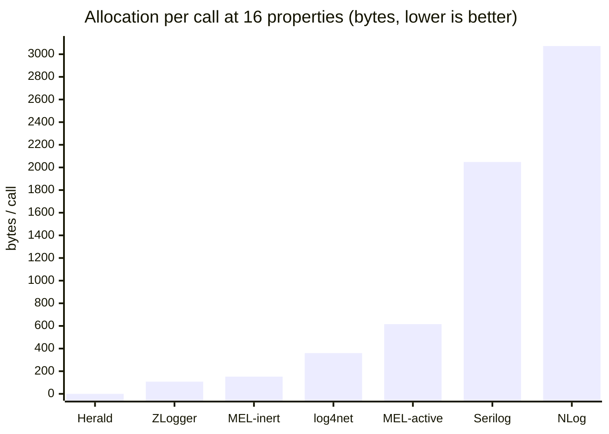
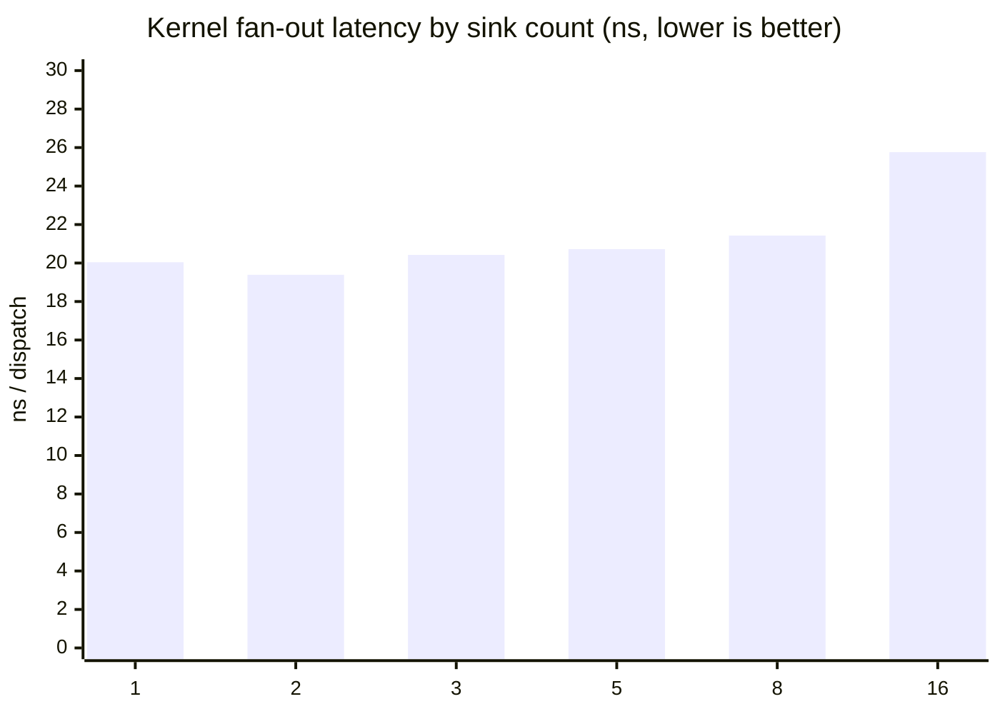
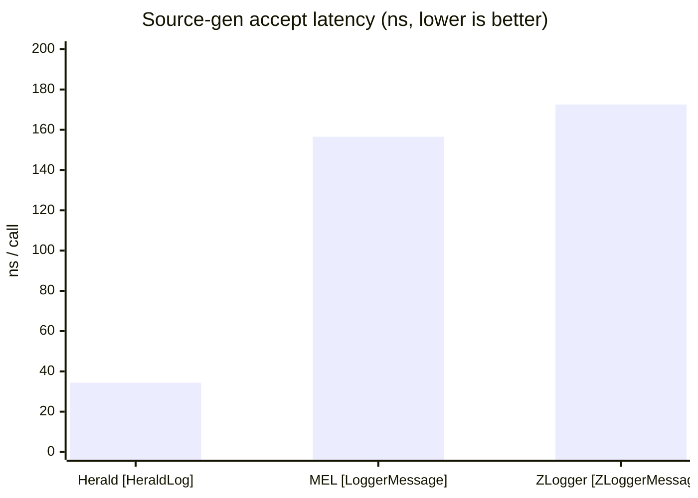
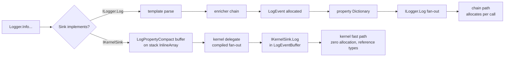

# Herald.OSS Benchmark Rollup

Current measurements for Herald.OSS on net10. Every row is sourced
from a per-bench doc and a BenchmarkDotNet raw artifact in this
repo. Reproduce instructions at the bottom.

## Host

```
BenchmarkDotNet v0.14.0, Windows 11 (10.0.26200.8246)
12th Gen Intel Core i9-12900K, 1 CPU, 24 logical and 16 physical cores
.NET SDK 10.0.203
  [Host]     : .NET 10.0.7 (10.0.726.21808), X64 RyuJIT AVX2
```

## Summary

| Workload | Herald | Note |
|---|---|---|
| Accept call, 4 mixed-type props | 36 ns, 72 B | NLog 58 ns, 248 B is the closest competitor |
| Accept call, 16 props all-strings | 37 ns, 0 B | MEL inert NullLogger 62 ns, 152 B is the closest |
| Source-gen accept, 4 props mixed | 34 ns, 48 B | MEL `[LoggerMessage]` 156 ns, 232 B; ZLogger 173 ns, 5 B |
| Rejected call (below floor) | 0.002 – 0.22 ns | Effectively JIT-eliminated |
| Redaction overhead (fast path) | +8 ns vs baseline, 0 B | No peer ships an equivalent fast path |
| Hot-reload JSON config swap | 40 μs end-to-end | No peer ships JSON-driven runtime swap |
| Kernel fan-out, 16 sinks | 26 ns | Flat scaling 1 → 16 sinks (~20–26 ns) |
| Flight recorder, below-floor capture | ~0 ns | JIT-eliminated |
| Sink isolation, 1 throwing sink of 5 | 2.4 μs/event | Pipeline survives; cost is .NET exception overhead |
| MEL adapter (Herald via `ILogger<T>`) | 125 ns, 168 B | MEL native is 160 ns, 208 B |
| UTF-8 format end-to-end | 442 ns, 304 B | ZLogger 288 ns, 77 B is fastest |

---

## 1. Accept-call comparison (4 mixed-type properties)

Workload: `logger.Info(template, "alpha", 7, true, 3.14)`. Each
library configured with its idiomatic discarding sink.

### Latency



### Allocation



Source: `comparison-accept-call-net10-2026-05-14T18-10Z.md`.

---

## 2. Typed-args (16 properties, all-strings)

`Info<T1..T16>` with all-string property values.

### Latency



### Allocation



Source: `typed-args-net10-2026-05-14T19-30Z.md`.

---

## 3. Rejected-call (events below the pipeline floor)

Pipeline minimum level `warn`; emits at `trace`, `debug`, `info`.

| Shape | Mean |
|---|---:|
| `Trace.ZeroProps`, rejected | 0.003 ns |
| `Debug.ZeroProps`, rejected | 0.002 ns |
| `Info.ZeroProps`, rejected | 0.007 ns |
| `Debug.OneProp`, rejected | 0.22 ns |
| `Debug.FourProps`, rejected | 0.21 ns |
| `Warn.ZeroProps`, accepted (reference) | 25.16 ns |

Source: `rejected-call-net10-2026-05-14T19-09Z.md`.

---

## 4. Redaction

One PII property, `Mask` mode. Three pipelines on identical workload.

| Pipeline | Mean | Allocated |
|---|---:|---:|
| Baseline (no redaction) | 25.96 ns | — |
| `WithFastRedaction` | 34.20 ns | — |
| `WithCompiledRedaction` | 407.42 ns | 672 B |

Source: `redaction-net10-2026-05-14T19-09Z.md`.

---

## 5. Hot reload (JSON config swap)

End-to-end `HotReloadBootstrap.Reload(json)` including JSON parse.

| Path | Mean | Allocated |
|---|---:|---:|
| Fast path (level-only delta) | 40.15 μs | 53.79 KB |
| Slow path (structural rebuild) | 32.65 μs | 53.79 KB |

Source: `hot-reload-net10-2026-05-14T19-09Z.md`.

---

## 6. Kernel fan-out (1 → 16 sinks)

Pre-compiled `LogKernel` delegate dispatching to N kernel sinks.



Source: `kernel-fan-out-net10-2026-05-14T19-09Z.md`.

---

## 7. Source-gen head-to-head

`[HeraldLog]` vs `[ZLoggerMessage]` vs `[LoggerMessage]` on the
same template + four typed arguments.



| Library | Mean | Allocated |
|---|---:|---:|
| Herald `[HeraldLog]` | 34.39 ns | 48 B |
| MEL `[LoggerMessage]` | 156.52 ns | 232 B |
| ZLogger `[ZLoggerMessage]` | 172.54 ns | 5 B |

Source: `source-gen-net10-2026-05-14T23-10Z.md`.

---

## 8. MEL adapter overhead

Logging through Herald via `ILogger<T>`, compared to native Herald
and bare MEL.

| Path | Mean | Allocated |
|---|---:|---:|
| Herald native | 35.83 ns | 48 B |
| Herald via MEL adapter | 125.40 ns | 168 B |
| MEL native (active null) | 159.69 ns | 208 B |

Source: `mel-adapter-net10-2026-05-14T23-10Z.md`.

---

## 9. UTF-8 format end-to-end

Emit to UTF-8 bytes through each library's idiomatic
format-to-discard sink.

| Library | Mean | Allocated |
|---|---:|---:|
| Herald `Utf8JsonFormatter` | 442.3 ns | 304 B |
| ZLogger UTF-8 | 288.1 ns | 77 B |
| Serilog `CompactJsonFormatter` | 489.5 ns | 968 B |

Source: `utf8-format-net10-2026-05-14T23-10Z.md`.

---

## 10. Sink isolation

Five bridge sinks; one throws `InvalidOperationException` on every
emit. `SafeCompositeLogger` catches and continues.

| Configuration | Mean | Allocated |
|---|---:|---:|
| Five healthy bridge sinks | 397.3 ns | 664 B |
| Four healthy + one throwing | 2,406.1 ns | 1,224 B |

Source: `sink-isolation-net10-2026-05-14T23-10Z.md`.

---

## 11. Flight recorder

Below-floor capture into a 200-event ring buffer; trigger drains
the buffer on `error`.

| Path | Mean | Allocated |
|---|---:|---:|
| Below-floor capture (recorder on) | 0.20 ns | — |
| Below-floor reject (recorder off) | 0.22 ns | — |
| Trigger emit (drain current buffer) | 30.41 ns | 24 B |

Source: `flight-recorder-net10-2026-05-14T23-10Z.md`.

---

## Architecture

Two paths through the pipeline. Adopters pick which one their sink
takes by which interface they implement.



Standalone diagram: `hot-path-comparison.excalidraw`.

---

## What's not measured

- Async + batching throughput under sustained load
- Multi-sink across competitor libraries
- Concurrent producers / lock contention
- 24-hour soak with GC snapshots
- Multi-tenant isolation under load
- Cold-start latency

Each is queued as a follow-up; the current set covers the high-
leverage accept-path and feature-comparison story.

---

## Reproduce

```bash
git clone git@github.com:mmpworks/Herald.OSS.git
cd Herald.OSS

dotnet build benchmarking/library/net10/Herald.OSS.LibraryBenchmarks.csproj -c Release
dotnet build benchmarking/comparisons/net10/herald/Herald.Comparison.csproj -c Release

dotnet benchmarking/comparisons/net10/herald/bin/Release/net10.0/Herald.Comparison.dll \
  --filter "*" \
  --artifacts benchmarking/comparisons/net10/herald/results

dotnet benchmarking/library/net10/bin/Release/net10.0/Herald.OSS.LibraryBenchmarks.net10.dll \
  --filter "*" \
  --artifacts benchmarking/library/net10/results
```

For competitor rows: replace `herald` with `serilog`, `nlog`,
`zlogger`, `log4net`, or `MEL`.

Full methodology: `HOWTO.md`.

---

## Source docs

- `comparison-accept-call-net10-2026-05-14T18-10Z.md`
- `typed-args-net10-2026-05-14T19-30Z.md`
- `rejected-call-net10-2026-05-14T19-09Z.md`
- `redaction-net10-2026-05-14T19-09Z.md`
- `hot-reload-net10-2026-05-14T19-09Z.md`
- `kernel-fan-out-net10-2026-05-14T19-09Z.md`
- `accept-path-net10-2026-05-14T18-10Z.md`
- `source-gen-net10-2026-05-14T23-10Z.md`
- `mel-adapter-net10-2026-05-14T23-10Z.md`
- `utf8-format-net10-2026-05-14T23-10Z.md`
- `sink-isolation-net10-2026-05-14T23-10Z.md`
- `flight-recorder-net10-2026-05-14T23-10Z.md`
