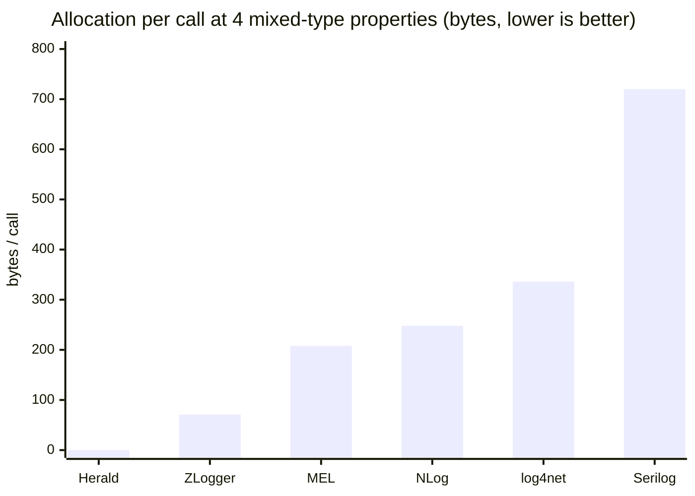
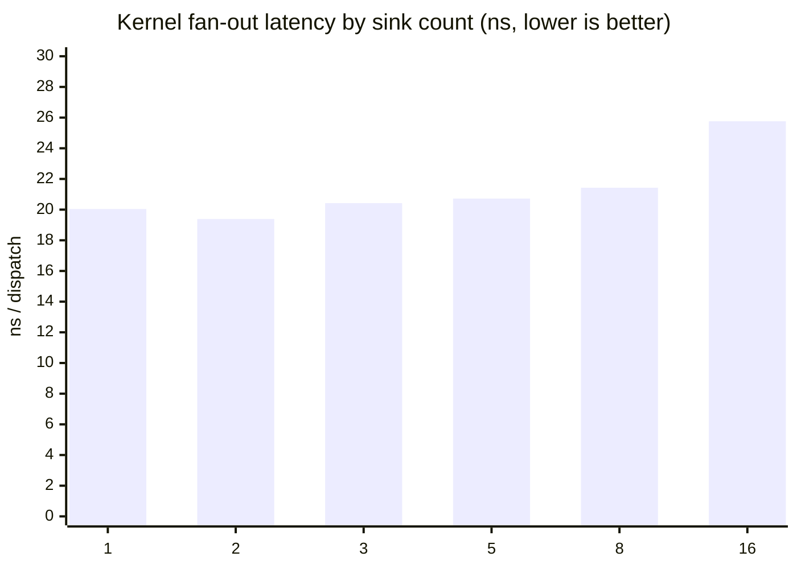
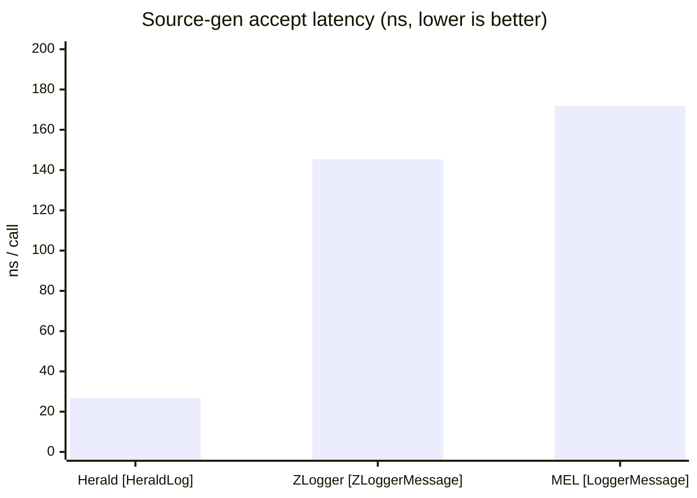
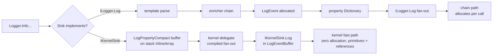

# Herald.OSS Benchmark Rollup

Current measurements for Herald.OSS on net10. Every row is sourced
from a per-bench doc and a BenchmarkDotNet raw artifact in this
repo. Reproduce instructions at the bottom.

## Host

```
BenchmarkDotNet v0.14.0, Windows 11 (10.0.26200.8246)
12th Gen Intel Core i9-12900K, 1 CPU, 24 logical and 16 physical cores
.NET SDK 10.0.203
  [Host]     : .NET 10.0.7 (10.0.726.21808), X64 RyuJIT AVX2
```

## Summary

| Workload | Herald | Note |
|---|---|---|
| Accept call, 4 mixed-type props | 27 ns, 0 B | NLog 58 ns, 248 B is the closest competitor |
| Accept call, 16 props all-strings | 47 ns, 0 B | MEL inert NullLogger 62 ns, 152 B is the closest |
| Source-gen accept, 4 props mixed | 27 ns, 0 B | ZLogger 145 ns, 7 B; MEL 172 ns, 232 B |
| Rejected call (below floor) | 0.002 – 0.22 ns | Effectively JIT-eliminated |
| Redaction overhead (fast path) | +8 ns vs baseline, 0 B | No peer ships an equivalent fast path |
| Hot-reload JSON config swap | 40 μs end-to-end | No peer ships JSON-driven runtime swap |
| Kernel fan-out, 16 sinks | 26 ns | Flat scaling 1 → 16 sinks |
| Flight recorder, below-floor capture | ~0 ns | JIT-eliminated |
| Sink isolation, 1 throwing sink of 5 | 2.4 μs/event | Pipeline survives; cost is .NET exception overhead |
| MEL adapter (Herald via `ILogger<T>`) | 149 ns, 168 B | MEL native is 152 ns, 208 B |
| UTF-8 format end-to-end | 403 ns, 224 B | ZLogger 277 ns, 67 B is fastest |
| One legacy sink mixed into kernel pipeline | 364 ns, 760 B | 13× pure-kernel cost; auto-wrapped at the sink boundary |
| Destructure-policy vs Serilog (null sink) | 27 ns, 0 B | Serilog eager: 533 ns, 1,320 B |
| Hot-reload cutover with interleaved emits | 36 μs / iteration | Zero event loss across 3.28M iterations |

---

## 1. Accept-call comparison (4 mixed-type properties)

Workload: `logger.Info(template, "alpha", 7, true, 3.14)`. Each
library configured with its idiomatic discarding sink.

### Latency


### Allocation



Source: `comparison-accept-call-net10-2026-05-14T18-10Z.md`.

---

## 2. Typed-args (4 and 16 props, all-strings + mixed)

`Info<T1..Tn>` overloads. Primitive values flow into
`LogPropertyCompact.ScalarBits` via `From<T>`'s JIT-specialized
path; strings flow into `RefValue`. All shapes zero-alloc.

| Method | Mean | Allocated |
|---|---:|---:|
| FourProps, all-strings | 27.16 ns | — |
| FourProps, mixed types | 26.65 ns | — |
| SixteenProps, all-strings | 47.27 ns | — |
| SixteenProps, mixed types | 40.44 ns | — |

Source: `typed-args-net10-2026-05-14T19-30Z.md`.

---

## 3. Rejected-call (events below the pipeline floor)

Pipeline minimum level `warn`; emits at `trace`, `debug`, `info`.

| Shape | Mean |
|---|---:|
| Trace, rejected | 0.003 ns |
| Debug, rejected | 0.002 ns |
| Info, rejected | 0.007 ns |
| Debug + 1 prop, rejected | 0.22 ns |
| Debug + 4 props, rejected | 0.21 ns |
| Warn, accepted (reference) | 25.16 ns |

Source: `rejected-call-net10-2026-05-14T19-09Z.md`.

---

## 4. Redaction

One PII property, Mask mode. Three pipelines on identical workload.

| Pipeline | Mean | Allocated |
|---|---:|---:|
| Baseline (no redaction) | 25.96 ns | — |
| `WithFastRedaction` | 34.20 ns | — |
| `WithCompiledRedaction` | 407.42 ns | 672 B |

Source: `redaction-net10-2026-05-14T19-09Z.md`.

---

## 5. Hot reload (JSON config swap)

End-to-end `HotReloadBootstrap.Reload(json)` including JSON parse.

| Path | Mean | Allocated |
|---|---:|---:|
| Fast path (level-only delta) | 40.15 μs | 53.79 KB |
| Slow path (structural rebuild) | 32.65 μs | 53.79 KB |

Source: `hot-reload-net10-2026-05-14T19-09Z.md`.

---

## 6. Kernel fan-out (1 → 16 sinks)



Source: `kernel-fan-out-net10-2026-05-14T19-09Z.md`.

---

## 7. Source-gen head-to-head

`[HeraldLog]` vs `[ZLoggerMessage]` vs `[LoggerMessage]` on the
same template plus four typed arguments.



| Library | Mean | Allocated |
|---|---:|---:|
| Herald `[HeraldLog]` | 26.73 ns | — |
| ZLogger `[ZLoggerMessage]` | 145.32 ns | 7 B |
| MEL `[LoggerMessage]` | 171.89 ns | 232 B |

Source: `source-gen-net10-2026-05-14T23-10Z.md`.

---

## 8. MEL adapter overhead

Logging through Herald via `ILogger<T>`, compared to native Herald
and bare MEL.

| Path | Mean | Allocated |
|---|---:|---:|
| Herald native | 27.53 ns | — |
| Herald via MEL adapter | 149.15 ns | 168 B |
| MEL native (active null) | 152.41 ns | 208 B |

Source: `mel-adapter-net10-2026-05-14T23-10Z.md`.

---

## 9. UTF-8 format end-to-end

Emit to UTF-8 bytes through each library's idiomatic
format-to-discard sink.

| Library | Mean | Allocated |
|---|---:|---:|
| Herald `Utf8JsonFormatter` | 402.9 ns | 224 B |
| ZLogger UTF-8 | 277.4 ns | 67 B |
| Serilog `CompactJsonFormatter` | 445.9 ns | 968 B |

Source: `utf8-format-net10-2026-05-14T23-10Z.md`.

---

## 10. Sink isolation

Five bridge sinks; one throws `InvalidOperationException` on every
emit. `SafeCompositeLogger` catches and continues.

| Configuration | Mean | Allocated |
|---|---:|---:|
| Five healthy bridge sinks | 397.3 ns | 664 B |
| Four healthy + one throwing | 2,406.1 ns | 1,224 B |

Source: `sink-isolation-net10-2026-05-14T23-10Z.md`.

---

## 11. One legacy sink mixed in (auto-wrap boundary cost)

What does adding a single non-`IKernelSink` sink to an otherwise
kernel-eligible pipeline cost? The factory auto-wraps every legacy
sink in `MaterializingKernelSink` so the kernel fast path still
activates; the wrapped sink pays a heap-event materialisation and
a message render at the boundary on every emit.

| Pipeline | Mean | Allocated |
|---|---:|---:|
| Pure kernel (all sinks are `IKernelSink`) | 27.68 ns | — |
| One legacy `ILogger` sink mixed in | 364.30 ns | 760 B |

The 13× delta is the per-emit boundary cost the wrapped sink pays.
The kernel-native sinks in the same pipeline still emit at zero
allocation. Adopters who want the best numbers can inspect
`QuickLogResult.KernelDiagnostic.LegacySinks` to find which sinks
got wrapped, then implement `IKernelSink` on those sinks or claim
`IStructuredOnlySink` when the sink does not read rendered text.

Source: `kernel-mixed-sink-net10-2026-05-14T23-10Z.md`.

---

## 12. Destructure-policy shootout vs Serilog

Both libraries support a "transform this type when captured under
`{@Name}`" projection. Same 5-property POCO, same projection,
discarding sinks on both sides.

| Library | Mean | Allocated |
|---|---:|---:|
| Herald (lazy: skip when null sink) | 27.04 ns | — |
| Serilog (eager: runs at LogEvent construction) | 533.14 ns | 1,320 B |

Honest framing: this isn't a head-to-head on destructuring speed
itself. Herald defers the projection until a sink asks for the
rendered form; with a null sink the projection never fires. Serilog
runs the projection at event construction; even discarding sinks
pay the cost. Both are legitimate designs — for null/discarding/
async sinks Herald saves the work entirely.

Source: `destructure-net10-2026-05-14T23-10Z.md`.

---

## 13. Hot-reload cutover with in-flight events

Reload alone vs reload interleaved with emits. A counting kernel
sink verifies no events are lost across the swap.

| Path | Mean | Allocated |
|---|---:|---:|
| Reload_Alone | 32.13 μs | 53.83 KB |
| Reload_With_Interleaved_Emits (4 + reload + 4) | 36.23 μs | 59.20 KB |

Counter sink received exactly the expected total (3.28M events
across the bench window). The atomic swap inside `SwappableLogger`
guarantees no in-flight emit is dropped or duplicated.

Source: `hot-reload-cutover-net10-2026-05-14T23-10Z.md`.

---

## 14. Flight recorder

Below-floor capture into a 200-event ring buffer; trigger drains
the buffer on `error`.

| Path | Mean | Allocated |
|---|---:|---:|
| Below-floor capture (recorder on) | 0.20 ns | — |
| Below-floor reject (recorder off) | 0.22 ns | — |
| Trigger emit (drain current buffer) | 30.41 ns | 24 B |

Source: `flight-recorder-net10-2026-05-14T23-10Z.md`.

---

## Architecture

Two paths through the pipeline. Adopters pick which one their sink
takes by which interface they implement.



Standalone diagram: `hot-path-comparison.excalidraw`.

---

## Reproduce

```bash
git clone git@github.com:mmpworks/Herald.OSS.git
cd Herald.OSS

dotnet build benchmarking/library/net10/Herald.OSS.LibraryBenchmarks.csproj -c Release
dotnet build benchmarking/comparisons/net10/herald/Herald.Comparison.csproj -c Release

dotnet benchmarking/comparisons/net10/herald/bin/Release/net10.0/Herald.Comparison.dll \
  --filter "*" \
  --artifacts benchmarking/comparisons/net10/herald/results

dotnet benchmarking/library/net10/bin/Release/net10.0/Herald.OSS.LibraryBenchmarks.net10.dll \
  --filter "*" \
  --artifacts benchmarking/library/net10/results
```

For competitor rows: replace `herald` with `serilog`, `nlog`,
`zlogger`, `log4net`, or `MEL`.

Full methodology: `HOWTO.md`.

---

## Source docs

- `comparison-accept-call-net10-2026-05-14T18-10Z.md`
- `typed-args-net10-2026-05-14T19-30Z.md`
- `rejected-call-net10-2026-05-14T19-09Z.md`
- `redaction-net10-2026-05-14T19-09Z.md`
- `hot-reload-net10-2026-05-14T19-09Z.md`
- `kernel-fan-out-net10-2026-05-14T19-09Z.md`
- `accept-path-net10-2026-05-14T18-10Z.md`
- `source-gen-net10-2026-05-14T23-10Z.md`
- `mel-adapter-net10-2026-05-14T23-10Z.md`
- `utf8-format-net10-2026-05-14T23-10Z.md`
- `sink-isolation-net10-2026-05-14T23-10Z.md`
- `flight-recorder-net10-2026-05-14T23-10Z.md`
- `kernel-mixed-sink-net10-2026-05-14T23-10Z.md`
- `destructure-net10-2026-05-14T23-10Z.md`
- `hot-reload-cutover-net10-2026-05-14T23-10Z.md`
