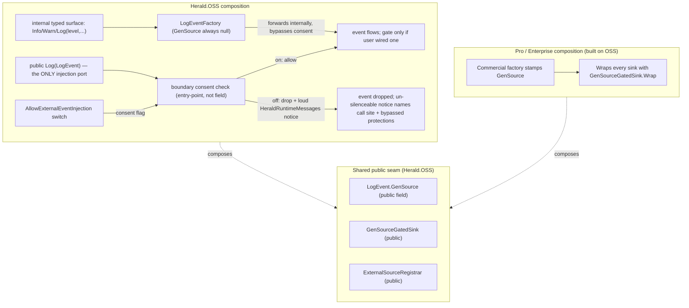

# ADR: Opt-in switch for external (hand-built) event injection

Status: SETTLED — co-signed by Jared (2026-06-02) with one required change (entry-point
discrimination, §7.1); OFF-path decided by Steve (loud, non-throwing). Design-only; implementation
is a separate Steve go. No code change yet.
Authors: Richard (architecture). Jared (co-owner of the gate / injection / provenance side)
co-signed and supplied the required §7.1 change; the licensing/legal item is flagged for Max plus
a real lawyer.
Date: 2026-06-02
Supersedes nothing. Builds on `docs/design/serilog-compat-handbuilt-logevent.md` (the compat-ctor
feasibility note) and reconciles the `feedback_gensource_gating` memory against the verified
"GenSource is dormant in OSS" ground truth.

---

## 1. The decision in one paragraph

Hand-building a native `LogEvent` and pushing it through `ILogger.Log(logEvent)` is a real,
public capability in Herald.OSS today — and today it flows through silently, because the
GenSource gate that would otherwise scrutinize it is dormant. Steve's call: that capability
should be **off by default and refuse loudly when used without consent**, and **on only behind a
deliberate opt-in** that moves the protection burden (and the license liability) to the user.
This ADR designs that switch: one builder method, `AllowExternalEventInjection()`, paired with a
Roslyn analyzer (HRLD-family) that flags the injection call at compile time. The refusal is
**loud but non-throwing**: when the switch is off, an injected event is dropped and a mandatory,
un-silenceable runtime notice fires through `HeraldRuntimeMessages` — a log call never throws.
The boundary discriminates by **entry point, not field value**: the public `Log(LogEvent)` port is
the only injection boundary, the consent check lives there and nowhere else, and the internal typed
surface (`Info`/`Warn`/core `Log(level, ...)`) builds via the factory and forwards internally,
never routing through the consent gate. Internal events therefore can't reach the consent gate by
construction. The paid tiers never touch the switch — they compose the always-on enforced gate over
the same public seam. The switch and the paid enforcement are two compositions of one mechanism, not
two copies of it.

---

## 2. Baseline — what actually happens today when a user injects a hand-built event

This is the part that has to be exactly right, because two of our own records appear to disagree.
They don't; they describe two different pipeline shapes.

### 2.1 The injection port

`ILogger.Log(LogEvent logEvent)` is public (`src/ILogger.cs`). The native `LogEvent` is a public
`sealed record` with a public positional constructor whose parameters include `GenSource`
(`src/Events/LogEvent.cs`). Any consumer can hand-build an event with GenSource defaulting to
null and pass it to `result.Logger.Log(ev)` — `result.Logger` is a `StructuredLogger : ILogger`.
Nothing in the type system stops this. It compiles, and `StructuredLogger.Log(LogEvent)` accepts
it.

### 2.2 What the event hits on the default OSS path

The default pipeline a `QuickLogBuilder` produces is the decorator chain
(rendering -> filter slot -> level filter -> fan-out to sinks). I verified the whole `src/` tree:

- `GenSourceGatedSink.Wrap(...)` is **never called anywhere in OSS source.** The gate class is
  public and complete, but no OSS composition path constructs it.
- No OSS factory stamps `GenSource`. Events built by the OSS hot path carry `GenSource = null`
  by design (documented on the `LogEvent` record itself). Jared verified this directly:
  `LogEventFactory.Create` and `LogEventFactory.CreateFastPath` never stamp `GenSource`, so every
  OSS internal event is `GenSource = null` — byte-identical on that field to a hand-built injected
  event. This is why the boundary cannot discriminate by field value in OSS (§4.3).
- The only always-present admission check on the default path is the **level filter**
  (`LevelFilteredKernelSink`), which gates on level, not on provenance.

So **today, a hand-built event injected via `Log(LogEvent)` flows through.** If its level passes
the floor, it renders and reaches the sinks like any pipeline-built event. There is no silent
drop on the default path — because there is no gate on the default path.

### 2.3 Reconciling the `feedback_gensource_gating` memory

The memory says hand-built `Log(LogEvent)` events "are silently dropped." That is true **only
when a GenSourceGatedSink is in the composition** — and the gate's drop is correct behaviour:
`IsAccepted(null)` returns false, so an event with `GenSource = null` (every hand-built event)
is rejected, and with `onRejection = null` (the production default) it is dropped without a
trace (`GenSourceGatedSink.Log`, lines 211-220).

The two records reconcile cleanly:

| Pipeline shape | Hand-built event behaviour today |
|---|---|
| OSS default (no gate wired) | **Flows through** — no provenance check exists |
| Any pipeline that composes a `GenSourceGatedSink` | **Silently dropped** — `GenSource` is null, gate rejects, `onRejection` is null |

The memory captured the second row from a pipeline that had wired the gate (a commercial-shaped
composition, or a test). The "dormant seam" ground truth describes the first row. Both are real.

### 2.4 The actual footgun — and it is two footguns

1. **Flow-through is silent consent.** On the default path, injection just works, with no
   acknowledgement that the user has stepped outside the pipeline's guarantees (no factory
   stamping of time/scope/tenant/enrichment, no template rendering, no redaction-processor pass).
   The user gets an un-vetted event in their sink stream and nothing told them they opted out of
   the pipeline's protections.

2. **Gated-drop is silent refusal.** The moment a gate is in the composition, the same call
   silently vanishes. `onRejection = null` in production means a dropped event leaves no notice.
   A user who relied on flow-through, then later added a gated sink (or upgraded to a wrapper that
   wires one), watches their injected events disappear with no diagnostic.

Steve wants both silences replaced with one loud, honest behaviour: off drops the event and says so,
loudly and exactly; on works, and the user owns the consequences.

---

## 3. The switch

### 3.1 What it is

A single QuickLogBuilder opt-in method, AllowExternalEventInjection(), returning the builder for
fluent chaining.

One switch, one job (CUPID, Unix philosophy). It does exactly one thing: it flips a build-time
flag that the composed StructuredLogger reads on its Log(LogEvent) entry. It does NOT configure
routing, does NOT register sources, does NOT set up a gate. It is the consent bit and nothing else.

The flag rides through the JSON config the builder already produces (per the
feedback_json_is_source_of_truth rule, the switch is a serialized field, not an in-memory-only
toggle), so a pipeline restored from JSON preserves the consent and a hot reload does not silently
re-arm the refusal.

### 3.2 Why a builder method, not the alternatives

I considered four shapes and rejected three:

- MSBuild property (e.g. HeraldAllowExternalInjection). Discoverable and hard to flip by accident,
  but it is the wrong altitude. Injection is a per-pipeline data-plane decision; an app can run two
  pipelines where one legitimately injects and one must not. A whole-assembly MSBuild flag cannot
  express that. Rejected as the primary switch (it returns below as the analyzer suppression knob).

- Assembly attribute (like HeraldBuildAssertionAttribute). Same altitude problem as MSBuild,
  assembly-wide, cannot be per-pipeline. Rejected.

- A separate injection-logger type the user resolves instead of the normal logger. Most type-safe
  shape (you cannot inject without holding the injection type), but it fractures the ILogger surface
  and pushes a second logger handle through the app DI graph. Fails CUPID Composable/Idiomatic:
  every consumer now reasons about which logger they hold. Rejected, too heavy for the consent it
  encodes.

- Builder method (chosen). Per-pipeline, lives where every other pipeline capability lives
  (WithAsyncLogging, WithFlightRecorder, WithHotReload), reads in the fluent chain, serializes into
  the config naturally, and is impossible to enable without typing the words Allow External Event
  Injection at the composition site. That is the whole point: self-documenting at the call site,
  nobody flips it by accident, and a reviewer reading the builder chain sees the consent in plain
  language.

### 3.3 Naming

AllowExternalEventInjection() over AllowHandBuiltEvents() or AllowDirectLogEvents(). External is
the word the existing seam already uses (ExternalSourceRegistrar, external callers, external source
tokens), so the method reads as native to the codebase (CUPID, Idiomatic). Injection names the act
honestly. The method name is the consent statement; it should sound slightly heavyweight, because
it is.

---

## 4. Off refuses loudly, without throwing. The compile-vs-runtime call.

### 4.1 Decision: loud non-throwing runtime notice as the enforcement, analyzer as the nudge

This is the load-bearing recommendation, so here is the reasoning rather than just the verdict.

The honest constraint is that the switch is a runtime/config decision the compiler cannot see.
AllowExternalEventInjection() might be called in Program.cs, read from a JSON file, or set by an
operator at hot-reload time. No analyzer can know at compile time whether a given Log(logEvent)
call will run against a pipeline that consented. So a compile-time-only solution CANNOT be the
enforcement, it can only be a nudge. A runtime-only solution leaves the user to discover the
refusal at run time, when a louder, earlier signal was available. The two mechanisms cover
different gaps, so we want both, each doing the job it can actually do.

**Runtime drop + loud notice, the enforcement (Steve's decision).** The composed
StructuredLogger.Log(LogEvent) entry checks the consent flag. When the flag is off and the event
arrived through the injection entry point (see §4.3 for the entry-point discriminator), the boundary
**drops the event and emits a mandatory, un-silenceable runtime notice** through
HeraldRuntimeMessages — the same channel the naming-policy and hot-reload decisions already use. The
notice names the call site, states the bypassed protections (notably redaction, plus
time/scope/tenant stamping, enrichment, and template rendering), and points to
AllowExternalEventInjection() as the opt-in (which transfers vetting responsibility to your app per
the license note) or the Info/typed-args surface as the protected path. The notice fires on the
FIRST such call so it surfaces early, located, and dev-visible.

A log call never throws. This is the deliberate, settled distinction from an earlier framing that
considered a runtime throw: throwing on the logging path is a strong action, and a logging library
that throws on a log call can take down a correctly-shaped-but-mistaken app. The loud non-throwing
notice fixes both silent footguns — off is now loud and exact — without ever making a log call a
crash site. It is AOT-clean (a flag read, an early-return drop, and a one-shot message emit, no
reflection), it works regardless of how the pipeline was configured, and it announces itself at the
exact call that did the wrong thing.

A **throwing** mode may exist ONLY behind a separate explicit opt-in knob (for teams that want a
hard runtime stop on accidental injection). It is never the default. The default OFF behaviour is
the loud non-throwing drop described above.

This is reinforced at the build layer for teams that want a build break: the HRLD0060 analyzer
(below) nudges at compile time, the MSBuild property (§7.2) governs analyzer suppression, and
HeraldStrictMode escalates the HRLD warning into a build error. A team that wants injection to fail
the build sets HeraldStrictMode; the runtime stays non-throwing regardless.

**Roslyn analyzer, the nudge (strong should-have).** A new HRLD-family diagnostic (next free code,
HRLD0060) flags any call to ILogger.Log(LogEvent) / Log(in LogEventBuffer) at the call site,
telling the author the call bypasses the Herald pipeline factory and to either enable
AllowExternalEventInjection() and suppress the diagnostic, or switch to the Info/typed-args surface.

This is idiomatic. Herald.OSS already ships an analyzer/generator project
(generators/MMP.Herald.OSS.Generators.csproj) emitting HRLD0002/0010/0051, and already has the
HeraldStrictMode escalation knob that turns HRLD warnings into errors. The injection analyzer slots
straight into that family. It gives the earliest possible signal (red squiggle while typing), it is
discoverable (the message names the switch), and a team that wants hard enforcement sets
HeraldStrictMode so the nudge becomes a build break.

The analyzer honest limit, stated plainly: it flags the call shape, not the config. It cannot know
whether the pipeline consented, so it warns on every direct-injection call and offers the
suppression as the yes-I-meant-it acknowledgement. That is acceptable: the analyzer job is to make
the user notice, and the runtime drop-and-notice is what actually enforces. The MSBuild property
suppression of HRLD0060 (§7.2) is the compile-time consent that pairs with the runtime
AllowExternalEventInjection() consent.

### 4.2 Why not compile-time only, or runtime only

- Compile-time only cannot enforce (cannot see config) and over-warns (flags consented injection
  too). It is a nudge wearing an enforcement costume. Insufficient alone.
- Runtime only enforces correctly but signals late and offers no IDE-time guidance. It works, but
  it leaves discoverability on the table when we already ship the analyzer infrastructure to do
  better.
- Both is right precisely because the two mechanisms fail in opposite directions: the analyzer is
  early but imprecise, the runtime notice is precise but later. Together they cover the developer
  first keystroke through their first run.

### 4.3 How external is decided at the runtime entry — entry-point discrimination

The refusal must fire on injected events but not on the pipeline's own internally-produced events.
The discriminator is **the entry point, not any field on the event**.

Jared verified the source ground truth: LogEventFactory.Create and CreateFastPath never stamp
GenSource, so every OSS internal event carries GenSource = null — byte-identical on that field to a
hand-built injected event. A field-value discriminator (e.g. comparing GenSource against a pipeline
reference token) therefore cannot tell internal from injected in OSS. It would only work in the PAID
composition, where the commercial factory stamps a token. In OSS there is no such token to compare,
so a value check is not viable.

The viable discriminator is structural — which method the event arrived through:

- The public StructuredLogger.Log(LogEvent) port is the ONLY injection boundary. The consent check
  lives there and nowhere else. An event that arrives at this port came from outside the pipeline,
  by definition of the port.
- The internal typed surface (Info / Warn / Error / core Log(level, ...)) builds the event via the
  factory and forwards it internally. It never routes through the public Log(LogEvent) consent
  check. Internal events therefore cannot reach the consent gate by construction.

So the rule is: at the public Log(LogEvent) entry, if injection is disabled, drop the event and emit
the runtime notice. There is no event-field comparison anywhere in this decision. This is a
structural guarantee — "internal events can't reach the consent gate by construction" — which is
cleaner and more robust than a value comparison, and is exactly what Jared required for co-sign
(§7.1). It also has no collision with the gate's own GenSource check (§7.4): the boundary asks "did
you consent to inject here?"; the gate, when present, independently asks "is this GenSource on the
accept list?". Two orthogonal checks at two altitudes.

---

## 5. On injects, and shifts the liability

With AllowExternalEventInjection() set, the runtime boundary stops dropping and the event flows.
Two things matter here.

### 5.1 It composes the existing public seam, no new machinery

On does not invent an injection path. The legitimate, gated injection mechanism already exists in
public OSS types: ExternalSourceRegistrar hands an external caller a derived key with the explicit
contract that external callers stamp it on events they construct directly so the named sinks accept
those events, and GenSourceGatedSink.RegisterAcceptedSource admits that key. A consumer who turns
the switch on and wants their injected events to survive a gated sink uses that registrar surface
to stamp a valid GenSource. On a non-gated default pipeline, the switch alone is enough: the event
flows because there is no gate to satisfy, and the switch is what tells the boundary to allow it.

So the switch on behaviour is: stop refusing at the boundary. Whether the event then needs a
stamped GenSource depends on whether the user pipeline has gated sinks, which is already governed
by the existing registrar/gate seam, not by new code.

### 5.2 Where the license liability attaches

The switch IS the liability hook. Calling AllowExternalEventInjection() is the consumer affirmative
act that moves the event-vetting burden from Herald to the consumer: a hand-built event skips
factory stamping, enrichment, template rendering, and critically the redaction processors, which
means the consumer is now responsible for ensuring an injected event carries no unredacted secret
or PII. The license injection-liability disclaimer attaches to this method call. I am not writing
license text (Max lane); I am naming the hook: the disclaimer binds to the
AllowExternalEventInjection() opt-in, and the XML-doc on that method must point to the license
clause in plain language so the consent and the disclaimer are read together at the call site.

Per the security-due-diligence/defensibility standard, the documentation around this switch must be
written to withstand a malfeasance claim: it must state, in the XML-doc and in a design/posture
doc, exactly which protections the user forgoes by flipping the switch (factory stamping,
enrichment, rendering, redaction), so the-user-was-not-warned is not a defensible position. That
posture doc is a deliverable that pairs with this ADR (Heather lane, dual-register).

---

## 6. The OSS / Paid seam

The constraint Steve set: the OSS switch must not constrain how paid composes its pipeline. It does
not, because the switch and the paid enforcement are two compositions of ONE public seam (the
GenSource gate plus the ExternalSourceRegistrar), not two implementations of it. The two tiers
discriminate differently and deliberately: OSS discriminates by entry point (it has no factory token
to compare); paid discriminates by the stamped GenSource at the gate.

- OSS ships the switch and the fail-loud boundary. Its default pipeline wires NO gate; the switch
  governs the boundary drop-and-notice. The boundary discriminates by entry point — the public
  Log(LogEvent) port is the only place the consent check runs. The internal typed surface builds via
  the factory and forwards internally, so internal events never reach the consent check. The switch
  is an OSS-only concept.

- Pro/Enterprise ignore the switch entirely. They own a modified pipeline that (a) stamps GenSource
  on every event through their commercial factory and (b) wraps every sink with
  GenSourceGatedSink.Wrap. In that composition the gate is ALWAYS on and enforced: an unstamped
  (hand-built, non-consented) event is rejected by the gate regardless of any OSS switch setting,
  because the gate does not read the switch, it reads GenSource. The paid protection is structural
  (every sink gated), not a flag.

- No duplicated logic. The two tiers ask different, non-overlapping questions over the same public
  seam. OSS asks, at one entry point, "did this event arrive through the injection port without
  consent?" — a structural, entry-point question, because OSS has no factory token to compare. Paid
  asks, at every sink, "is this event's stamped GenSource on the accept list?" — a value question,
  because the paid factory stamps a token. Neither tier reimplements the other's check. The OSS
  boundary deliberately does NOT validate GenSource; doing so would duplicate the gate and create a
  collision (§7.4). DRY holds because each question lives in exactly one place.

This is why the seam stays clean: paid never depends on the OSS switch existence. If we deleted
AllowExternalEventInjection() tomorrow, the paid composition would be unchanged, it was never
reading the flag. The switch is additive OSS surface over a seam the paid tier was already
composing differently.

Open verification item 7.3 for Jared (the paid boundary): confirm that the Pro/Enterprise factory
plus all-sinks-gated composition is in fact how paid wires it, and that no paid code path reads the
OSS consent flag, via a one-line grep of the paid tree for the consent-flag name. Clean by
construction in OSS; the grep gives full confirmation.

---

## 7. Open questions, hand-offs, and verification items

### 7.1 Jared, gate correctness / the discriminator — RESOLVED (required change, co-signed)
**Resolved: discriminate by entry point, not field value.** Jared verified the source:
LogEventFactory.Create and CreateFastPath never stamp GenSource, so every OSS internal event is
GenSource = null, byte-identical on that field to a hand-built injected event. A reference-token /
field-value discriminator therefore cannot tell internal from injected in OSS — it works only in the
PAID composition where the commercial factory stamps the token. The settled discriminator is
structural: the public Log(LogEvent) port is the ONLY injection boundary, the consent check lives
there and nowhere else, and the internal typed surface (Info/Warn/core Log(level,...)) builds via the
factory and forwards internally, never routing through the consent check. Internal events can't reach
the consent gate by construction. §4.3, §6, and §8 are written on this entry-point model; the earlier
field/token-check framing is removed.

### 7.2 Jared, analyzer/MSBuild consent wiring — CONFIRMED
The blessed compile-time acknowledgement of HRLD0060 is a dedicated **MSBuild property**
(`build_property.HeraldAllowExternalInjection`-style, matching the existing
HeraldStrictMode / NamingPolicy property pattern) that the analyzer reads as suppression. HRLD0060 is
the next free HRLD code. Two altitudes, two jobs, documented so nobody conflates them: the MSBuild
property is the **analyzer** suppression and is **assembly-wide** (it silences the compile-time
nudge across the assembly); the runtime AllowExternalEventInjection() builder method is the
**per-pipeline** enforcement consent. The MSBuild flag is NOT runtime consent — suppressing the
analyzer does not turn injection on at runtime, and turning injection on at runtime does not suppress
the analyzer. A team can legitimately want one without the other.

### 7.3 Jared, the paid boundary — OPEN VERIFICATION ITEM
Clean by construction in OSS. For full confirmation, grep the PAID tree
(Modules/Herald.Compliance plus the commercial wrappers) for the consent-flag name to confirm NO
paid path reads it. This is the load-bearing assumption that keeps the seam clean (§6). One-line
grep; record the result here when run.

### 7.4 Jared, the native receiver-side injection path — contract note (settled)
A registrar-stamped native event injected via Log(LogEvent) is still **"external" by entry point**:
it came through the injection port, not the factory, so the OSS consent boundary applies to it. On a
consented pipeline (switch on) it passes the boundary. If that pipeline also has gated sinks, the
**gate then independently checks the stamped GenSource key**. These are two orthogonal checks:
- the switch asks "did you consent to inject here?" (entry-point question, OSS boundary);
- the gate asks "is this GenSource on the accept list?" (value question, at each gated sink).
An event can pass consent and still be gate-rejected — they are different questions at different
altitudes. The boundary check must NOT also validate GenSource: doing so would duplicate the gate's
job and create a collision between the two checks. So the receiver path (e.g. the paid TesseraSeal
receiver instrumentation hand-building native events and stamping a registrar key) and this switch
agree by construction: the switch governs consent-to-inject at the port, the gate governs
acceptance-by-provenance at the sink, and neither reaches into the other's decision.

### 7.5 Max plus a real lawyer, the licensing/legal item
The license injection-liability disclaimer binds to the AllowExternalEventInjection() opt-in
(§5.2). The disclaimer text is Max lane. Per the security-due-diligence/defensibility standard, the
disclaimer plus the method XML-doc plus a posture doc must together document, defensibly against a
malfeasance claim, exactly which protections the user forgoes by flipping the switch (factory
stamping, enrichment, rendering, redaction). A real lawyer reviews the disclaimer wording before it
ships. Flagging now so it is not discovered at release.

### 7.6 Separable OSS item (Jared's, same primitive) — TRACKED STANDALONE
Default the gate's `onRejection` callback to a **runtime notice instead of null**, routed through
the SAME HeraldRuntimeMessages channel the OFF-path notice uses, so an operator sees consent-off
drops and gate drops the same way — one channel, one mental model for "Herald dropped your event and
here's why." This stands on its own merits regardless of the switch and is tracked as a standalone
OSS item (the gate is Jared's seam). It is the natural pair to the OFF-path loud notice: both turn a
silent drop into a located, dev-visible message on the same channel.

---

## 8. The footgun fix, restated

This ADR closes both silent failures on the injection path:

- Silent flow-through (default path, no gate): replaced by the boundary **drop + loud
  HeraldRuntimeMessages notice** when the switch is off. Injection now requires explicit consent and
  announces itself — by call site and bypassed protections — if attempted without it. The boundary
  decides by entry point: only events arriving through the public Log(LogEvent) port are scrutinized;
  internally-produced events build via the factory and forward internally, so they never reach the
  consent check.
- Silent drop (onRejection null on a gated sink): the legitimate injection path no longer reaches a
  gate by accident. With the switch off, injection is dropped at the boundary with a loud notice
  before it can reach a gate; with the switch on, the user has consented and (if they wired a gate)
  is using the registrar to stamp a valid GenSource, so the gate admits the event by design rather
  than dropping it by surprise.

Rejection is observable either way: the HRLD0060 analyzer at compile time, the loud non-throwing
notice at run time, and — for consumers who deliberately run a gate in diagnostics — the gate's
onRejection callback, which §7.6 recommends defaulting to a HeraldRuntimeMessages notice rather than
null, so even a gated drop in a consented pipeline leaves a trace on the same channel. A log call
never throws on any of these paths; a throwing mode exists only behind a separate explicit opt-in
knob (§4.1), never as the default.

---

## 9. One-line answer for Steve

Today a hand-built event flows through silently on the default pipeline and vanishes silently the
moment a gate is wired, both footguns. The fix is one builder switch, AllowExternalEventInjection():
off by default, where the pipeline boundary drops the event and fires a loud, located, un-silenceable
runtime notice (never a throw on a log call), backed by an HRLD0060 analyzer that nudges at compile
time; on, where the event flows and the license liability for vetting it shifts to the user via that
same opt-in. The boundary tells internal from injected by entry point, not by any field, because OSS
never stamps GenSource — the public Log(LogEvent) port is the only place consent is checked, and
internal events can't reach it by construction. Paid never touches the switch, it composes the
always-on enforced gate over the same public seam, so OSS consent and paid enforcement are two uses
of one mechanism, not two copies.
