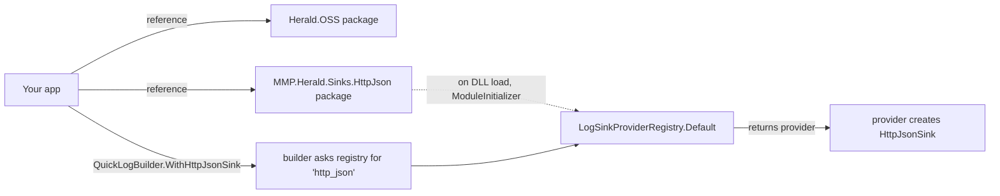

# Building sinks

A sink is the thing that takes a log event and writes it somewhere
— a console, a file, an HTTP endpoint, a queue. Herald.OSS ships
with a handful of built-in sinks. The rest of the ecosystem lives
in separate NuGet packages that follow a small contract.

This guide answers two questions:

1. **How do I plug in a sink someone else built?** A one-line
   `dotnet add package` and a builder call. Done.
2. **How do I build my own?** Two patterns, depending on whether you
   want a quick custom sink or one that registers with a name and
   shows up in JSON config.

Then it walks through what .NET actually does with a sink package
between build time and the first log call — because the answer is
short and reassuring, and it explains why the "sinks as separate
packages" model doesn't cost anything at runtime.

## Two questions about sinks

**Where does a sink come from?**

```
┌────────────────────────────┐
│  Built into Herald.OSS     │   console, bridge, channel,
│                            │   audit, file, network,
│                            │   null
├────────────────────────────┤
│  MMP.Herald.Sinks.* (NuGet)│   third-party destinations:
│                            │   HTTP/JSON endpoints,
│                            │   OpenTelemetry, Seq, Slack,
│                            │   Datadog, Loki, ...
├────────────────────────────┤
│  Your own (in your app)    │   bridge sinks for tests +
│                            │   integrations; custom
│                            │   ILogSinkProvider for first-
│                            │   class kinds with JSON config
└────────────────────────────┘
```

**How does the builder find a sink?**

A sink is identified by a lowercase **kind** string — `"console"`,
`"text_file"`, `"http_json"`, etc. The `QuickLogBuilder` asks a
registry: *"give me the provider for this kind."* The registry hands
back a small object that knows how to construct that sink type. The
builder calls `CreateSink(...)` and gets back the actual sink.

Every shipped sink package wires itself into the process-wide
registry when its DLL loads. You don't call a registration method.
Adding the package reference is the entire workflow.



If you write your own provider and don't want to ship a NuGet, you
hand it to the builder directly:

```csharp
builder.WithCustomSinkProvider(new MyProvider());
```

It's then scoped to that one builder — no process-wide effect.

## Plugging in an existing sink

The Herald sink ecosystem is one package per destination. Each one
follows the same shape.

```bash
dotnet add package MMP.Herald.Sinks.HttpJson
```

Then the builder method on `QuickLogBuilder` works directly:

```csharp
var herald = QuickLogBuilder.Create()
    .WithHttpJsonSink("https://logs.example.com/ingest")
    .WithMinimumLevel("info")
    .BuildAndCommit();

herald.Logger.Info(LogCategory.App, "hello");
```

When the process starts, the .NET runtime loads
`Herald.Sinks.HttpJson.dll` the first time something touches a type
in it. A small piece of generated code runs on assembly load —
called a *module initializer* — that registers the provider with
`LogSinkProviderRegistry.Default`. The builder's `WithHttpJsonSink`
extension asks the registry for the `"http_json"` kind and gets the
provider back.

That's the whole flow. No `Startup.cs` wiring, no `RegisterAll`
method to remember, no DI module to install.

## Building a quick custom sink: the bridge route

The shortest path to a custom sink doesn't need a provider at all.
A **bridge** is just an `ILogger` you write yourself. Herald hands
it events; you do whatever you want.

```csharp
public sealed class CapturingBridge : ILogger
{
    private readonly List<string> _captured = new();
    private readonly object _gate = new();

    public void Log(LogEvent e)
    {
        lock (_gate) { _captured.Add(e.Message); }
    }

    public IReadOnlyList<string> Snapshot()
    {
        lock (_gate) { return _captured.ToArray(); }
    }
}
```

Wire it:

```csharp
var bridge = new CapturingBridge();
var herald = QuickLogBuilder.Create()
    .WithBridge(bridge)
    .BuildAndCommit();
```

That's it. Bridges are the right answer for tests, custom routing,
quick integrations with code you already have. They don't get JSON
config support and they aren't named in the pipeline registry —
they're just an object you handed in.

If you need *more* — a kind name, JSON config round-trip, the
ability to be configured from a file — implement
`ILogSinkProvider`.

## Building a first-class sink: ILogSinkProvider

The provider contract has one required job: take a configuration
record and produce an `ILogger`. The contract:

```csharp
public interface ILogSinkProvider
{
    string SinkKind { get; }

    ILogger CreateSink(
        LoggingRuntimeSinkDefinition definition,
        ILogLevelRegistry levelRegistry,
        ILogOutputTransformerRegistry transformerRegistry);

    // Optional — manifest + form metadata for the Dashboard.
    string? GetCapabilityYaml() { ... }
    string? GetFormSchemaText() { ... }
}
```

`SinkKind` is the lowercase string that names this sink in JSON
config and in builder calls. `CreateSink` reads the definition's
properties (URL, path, batch size, whatever you need) and returns a
fresh sink instance.

A minimal example — a sink that writes one line per event to a
file:

```csharp
using MMP.Herald;
using MMP.Herald.Configuration.Runtime;
using MMP.Herald.Events;
using MMP.Herald.Levels;
using MMP.Herald.Output.Rendering;
using MMP.Herald.Routing;

public sealed class TinyFileProvider : ILogSinkProvider
{
    public string SinkKind => "tiny_file";

    public ILogger CreateSink(
        LoggingRuntimeSinkDefinition definition,
        ILogLevelRegistry levelRegistry,
        ILogOutputTransformerRegistry _)
    {
        var path = definition.PropertyBag.GetString("path")
                   ?? throw new InvalidOperationException("tiny_file: 'path' required");
        return new TinyFileSink(path);
    }
}

public sealed class TinyFileSink : ILogger, IDisposable
{
    private readonly StreamWriter _writer;
    private readonly object _gate = new();

    public TinyFileSink(string path) =>
        _writer = new StreamWriter(path, append: true) { AutoFlush = true };

    public void Log(LogEvent e)
    {
        lock (_gate) { _writer.WriteLine($"[{e.Level}] {e.Message}"); }
    }

    public void Dispose() => _writer.Dispose();
}
```

Then hand the provider to a builder:

```csharp
var herald = QuickLogBuilder.Create()
    .WithCustomSinkProvider(new TinyFileProvider())
    // ... and reference it by kind in your config / builder ...
    .BuildAndCommit();
```

For a NuGet-shipped sink, the project also embeds a `CAPABILITY.yaml`
manifest and a form schema file. The defaults in
`ILogSinkProvider` already read those embedded resources — most
real sinks don't override `GetCapabilityYaml` or
`GetFormSchemaText`. Look at `src/Quick/Serializers/Sinks/` in
the source for examples of the JSON config shape every kind uses.

## How auto-registration works

Every shipped sink package contains a tiny piece of code emitted by
the source generator that runs once when the DLL is loaded into a
process. That code calls `LogSinkProviderRegistry.Default.Register`
with the provider. From that moment, the builder can resolve the
sink by its kind string.

```
┌──────────────────────────────────────────────────────────┐
│  Your process                                            │
│                                                          │
│   ┌──────────────────┐    ┌──────────────────────────┐  │
│   │ MMP.Herald.OSS   │    │ MMP.Herald.Sinks.Foo     │  │
│   │ (kernel +        │    │ (one provider for "foo") │  │
│   │  registry)       │    └────────────┬─────────────┘  │
│   └──────────────────┘                 │                │
│            ▲                           │ ModuleInitializer
│            │                           ▼                │
│   ┌────────┴──────────┐    ┌──────────────────────────┐ │
│   │ LogSinkProvider   │◀───│ Registry.Default         │ │
│   │ Registry          │    │ .Register(new FooProvider│ │
│   │ (process-wide)    │    │           ())            │ │
│   └───────────────────┘    └──────────────────────────┘ │
└──────────────────────────────────────────────────────────┘
```

The generator output lives at `src/...Generators/SinkAutoRegistrationGenerator`
in each sink package. You don't write it. You don't see it. It just
runs.

## What the runtime actually pays

Here's the practical answer to the obvious question: *does putting
a sink in a separate DLL slow anything down?*

No, not at steady state. There's a small one-time cost at startup,
same as any other .NET assembly. Three stages:

| Stage | When | Cost | Happens per event? |
|---|---|---|---|
| Build | `dotnet build` | NuGet fetch — milliseconds, cached after the first | no |
| Assembly load | First reference to a type in the sink's DLL | ~1–5 ms per DLL | no |
| JIT compile | First call to a method in the sink | microseconds per method | no |
| Registry lookup | Builder time only | nanoseconds | no |
| `sink.Log(event)` | Every event | one regular interface call | yes |

The reason this is cheap: .NET stitches DLLs together in memory
when the program is already running. The compiler doesn't know
which DLL a method came from — it just gets the address from the
runtime and emits a normal call. Once the call site is set up, the
generated machine code doesn't care that the target lives in a
different file. The assembly boundary disappears.

The contrast with C++ is the most useful way to picture it. In C++,
every separate library is linked into one binary at build time —
the boundary doesn't exist at runtime because everything was glued
together before launch. In .NET, the libraries stay as separate
files on disk and only get hooked up when the running process
actually reaches a type in them. Either way, the per-call cost
after wiring is identical.

## What `sink.Log(event)` actually runs

For most sinks, what happens at the call site is:

1. The pipeline already holds an `ILogger` reference to your sink
   from when the builder ran.
2. The CPU executes a virtual call through the `ILogger` interface
   table.
3. Control jumps into your sink's `Log` method body — wherever it
   was JIT'd at first call.

That's two CPU instructions plus your method body. The kernel path
adds the `IKernelSink` variant on top, which removes one allocation
per event — see [`kernel-sink-pattern.md`](kernel-sink-pattern.md)
for that.

## AOT and trimming

If your application publishes as native AOT, the rules shift a
little:

- There's no JIT at runtime. The whole binary is native machine
  code, baked at `dotnet publish` time.
- There's no assembly loading at runtime. Everything reachable from
  the app gets pulled into the single native binary.
- Trimming removes types that nothing references. A sink package
  you reference but never use through any code path can be trimmed
  away.

The whole AOT story for Herald.OSS lives in
[`aot-and-trimming.md`](aot-and-trimming.md). The short version:
the OSS package, the source generator, and the built-in sinks are
all AOT-clean.

## Two failure modes worth knowing about

**"Sink kind not found."** You called
`.WithSomeSink("...")` but the matching package isn't referenced.
The registry has no entry for the kind. The builder throws at
`Build()` time with the kind name in the message. Fix: add the
`MMP.Herald.Sinks.*` package reference. The auto-registration
takes care of the rest.

**The custom provider isn't picked up.** You wrote your own
`ILogSinkProvider` but forgot to call `WithCustomSinkProvider`.
Custom providers are not auto-registered (that's deliberate — they
shouldn't leak into other builders in the same process). Hand it
to the builder explicitly.

## Where to look next

- [`../howtos/HOWTO-SINKS.md`](../howtos/HOWTO-SINKS.md) — recipe-
  oriented sink configuration, including JSON config round-trip.
- [`kernel-sink-pattern.md`](kernel-sink-pattern.md) — the
  zero-allocation `IKernelSink` opt-in for hot-path sinks.
- [`aot-and-trimming.md`](aot-and-trimming.md) — publishing native
  AOT with Herald.OSS.
- `src/Routing/ILogSinkProvider.cs` — the provider contract.
- `src/Routing/LogSinkProviderRegistry.cs` — the registry +
  `Default`.
- `src/Quick/Serializers/Sinks/` — the JSON config serializer for
  every built-in sink kind. The shape your provider produces should
  round-trip the same way.
